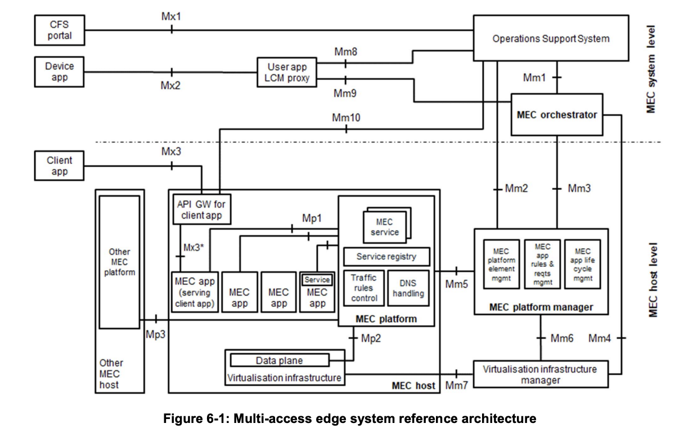

# Compliance Study of Nuvla Edge Orchestration Solution
## Assessment of Compliance with ETSI MEC Standards

**Standards:**
- [ETSI GS MEC 003 Framework and Reference Architecture V4.1.1 (2025-05)](https://www.etsi.org/deliver/etsi_gs/mec/001_099/003/04.01.01_60/gs_mec003v040101p.pdf)
- [ETSI GS MEC 010-2 MEC Management; Part 2: Application lifecycle, rules and requirements management V4.1.1 (2025-05)](https://www.etsi.org/deliver/etsi_gs/MEC/001_099/01002/04.01.01_60/gs_MEC01002v040101p.pdf)
- [ETSI MEC 037 Application Package Format and Descriptor Specification V3.2.1 (2024-04)](https://www.etsi.org/deliver/etsi_gs/MEC/001_099/037/03.02.01_60/gs_MEC037v030201p.pdf)

- [ETSI MEC 011 Edge Platform Application Enablement](https://www.etsi.org/deliver/etsi_gs/MEC/001_099/011/03.02.01_60/gs_MEC011v030201p.pdf)
- [ETSI MEC 021 Application Mobility Service API V2.2.1 (2022-02)](https://www.etsi.org/deliver/etsi_gs/MEC/001_099/021/02.02.01_60/gs_mec021v020201p.pdf)
- [ETSI MEC 040 Federation enablement APIs V3.2.1 (2024-03)](https://www.etsi.org/deliver/etsi_gs/MEC/001_099/040/03.02.01_60/gs_MEC040v030201p.pdf)

**Scope:** Minimum Viable MEC Orchestrator (MEO)

---

This document assesses Nuvla's compliance with ETSI MEC standards for operating as a **MEC Orchestrator (MEO)**. The MEO is the core system-level management component responsible for orchestrating application lifecycle across multiple edge hosts.

---

## 1. MEC Orchestrator Requirements

According to ETSI GS MEC 003 §7.1.4.1, the MEO has the following critical responsibilities:

```
7.1.4.1 MEC orchestrator
The MEO is the core functionality in MEC system level management.
The MEO is responsible for the following functions:
• maintaining an overall view of the MEC system based on deployed MEC hosts, available resources, available MEC services, and topology;
• on-boarding of application packages, including checking the integrity and authenticity of the packages, validating application rules and requirements and if necessary adjusting them to comply with operator policies, keeping a record of on-boarded packages, and preparing the Virtualisation infrastructure manager(s) to handle the applications;
• selecting appropriate MEC host(s) for application instantiation based on constraints, such as latency, available resources, and available services;
• triggering application instantiation and termination;
• triggering application relocation as needed when supported;
• coordinating with the OSS the application instantiation lifecycle management operations.
```



**Mapping to ETSI MEC Specifications and Reference Points**

- **Maintaining an overall view of the MEC system** (deployed MEC hosts, resources, services, topology)
	- **Relevant specs:** ETSI GS MEC 003 (system-level roles and reference points), ETSI GS MEC 010-2 (MEO–MEPM orchestration flows), ETSI GS MEC 011 (service and application information used for catalog/topology).
	- **Reference points:**
		- **Mm3 (MEO–MEPM)** – MEO as **client**, MEPM as **server** (MEO queries capabilities/resources/hosts, receives status).

- **On-boarding of application packages** (integrity/authenticity checks, rule/requirement validation, operator policies, catalogue of packages, preparing the VIM)
	- **Relevant specs:** ETSI GS MEC 003 (MEO responsibilities for on-boarding), ETSI GS MEC 010-2 (information used during instantiation), ETSI GS MEC 011 (application descriptors, traffic/DNS rules, service requirements), ETSI MEC 037 (when aligned with NFV-MANO/VNFD packaging).
	- **Reference points:**
		- **Mm1 (MEO–OSS)** – OSS as **client**, MEO as **server**; OSS can submit application on-boarding requests and associated policies/intents, which the MEO then realizes via its catalog and southbound interfaces.
		- **Mm3 (MEO–MEPM)** – MEO as **client**, MEPM as **server** (MEO provides package identifiers/requirements and requests preparation of hosts/VIM for supported apps).

- **Selecting appropriate MEC host(s) for application instantiation** (latency, resources, services)
	- **Relevant specs:** ETSI GS MEC 003 (placement logic owned by MEO), ETSI GS MEC 010-2 (instantiate/terminate flows where host is an input), ETSI GS MEC 011 (application rules/requirements that drive placement).
	- **Reference points:**
		- **Mm1 (MEO–OSS)** – OSS as **client**, MEO as **server**; OSS may provide placement-related constraints or intents (e.g. policy, region) while MEO retains detailed placement logic.
		- **Mm3 (MEO–MEPM)** – MEO as **client**, MEPM as **server** (MEO queries resource/capability state and sends placement decisions, indicating target host/MEPM).

- **Triggering application instantiation and termination**
	- **Relevant specs:** ETSI GS MEC 003 (high-level responsibility for app lifecycle), ETSI GS MEC 010-2 (Application LCM API: instantiate, terminate, operate, query operations and states).
	- **Reference points:**
		- **Mm1 (MEO–OSS)** – OSS as **client**, MEO as **server**, used to trigger application instantiation/termination/operate requests at MEC system level and to coordinate application instantiation lifecycle procedures.
		- **Mm3 (MEO–MEPM)** – MEO as **client**, MEPM as **server** (MEO invokes instantiate/terminate/operate/query on MEPM for specific app instances).

- **Triggering application relocation as needed when supported**
	- **Relevant specs:** ETSI GS MEC 003 (relocation as part of MEO responsibilities), ETSI GS MEC 010-2 (use of terminate + instantiate / operate operations to realize relocation workflows), ETSI GS MEC 021 (Application Mobility Service API, when used to trigger/coordinate mobility and state transfer).
	- **Reference points:**
		- **Mm1 (MEO–OSS)** – OSS as **client**, MEO as **server**, used to request/trigger relocation at service level and to consume relocation progress/events reported by the MEO.
		- **Mm3 (MEO–MEPM)** – MEO as **client**, one or more MEPMs as **servers** (MEO co-ordinates relocation by orchestrating terminate on the source host and instantiate on the target host, and by tracking resulting states).

> **Note on other MEC 003 reference points:** Mm4 (OSS–VIM), Mm9 (MEO–user app LCM proxy) and Mfm (MEO–MEC federator) also appear in the reference architecture and are relevant for infrastructure management, user-app LCM proxying and MEC federation respectively. They are considered **out of scope for this Minimum Viable MEO** and therefore not mapped in detail in this document.

### Gap Analysis vs. MEC Orchestrator Responsibilities

From a Nuvla implementation perspective, the MEC orchestrator responsibilities above translate into the following concrete gaps, ordered by the sequence in which they should be addressed:

1. **On-boarding of application packages (Gap: MEC-compliant onboarding workflow)**  
	Nuvla already has a notion of modules/packages, but does not yet offer a MEC-compliant onboarding flow driven by MEC 037 descriptors and coordinated over Mm1/Mm3. Missing elements include: a clear OSS-driven onboarding API over Mm1, storage and versioning of MEC app packages and descriptors, and integration of onboarding with southbound preparation of hosts (Mm3 plus any NFV-MANO/VIM integration).

2. **Triggering application instantiation and termination (Gap: MEC 010-2 lifecycle layer)**  
	While Nuvla can already deploy workloads, it lacks a MEC 010-2–compatible application lifecycle layer (AppInstanceInfo, InstantiateAppRequest, AppLcmOpOcc, state model, ProblemDetails) that is exposed northbound and mapped to existing deployment resources. Implementing this lifecycle layer is the core orchestration capability required for MEO compliance.

3. **Coordinating with the OSS the application instantiation lifecycle management operations (Gap: production-grade Mm1 interface)**  
	Today, OSS does not interact with Nuvla via a standardised Mm1 reference point. A stable northbound interface is needed so OSS can submit orders/policies and query lifecycle status, alarms and performance information using MEC semantics. The gap covers designing the Mm1 API, mapping OSS operations to MEC 010-2 lifecycle semantics, and ensuring consistent reporting of lifecycle outcomes.

4. **Selecting appropriate MEC host(s) for application instantiation (Gap: placement engine)**  
	Placement in Nuvla is currently per-device and relatively basic. To align with MEC expectations, Nuvla needs a placement engine that takes MEC app requirements and policies as input (from descriptors and Mm1) and matches them with host capabilities and available services (via Mm3 and internal metrics), with deterministic selection, policy adherence and clear handling of placement failures.

5. **Triggering application relocation as needed when supported (Gap: standardised relocation orchestration)**  
	Nuvla supports a form of migration today by cloning and redeploying stateless applications on another device. MEC-compliant relocation requires exposing relocation as a first-class lifecycle operation (over Mm1), orchestrating coordinated terminate+instantiate sequences via Mm3, and, for stateful apps, integrating with data/state handling to minimise downtime and preserve service continuity.

6. **Validating application rules and requirements and adjusting them to comply with operator policies (Gap: policy enforcement in the pipeline)**  
	A feasibility study for integrating OPA was positive, but there is no production-grade policy validation step wired into onboarding and instantiation. The gap is an enforced policy engine that evaluates MEC app rules/requirements (from descriptors/IaC) against operator policies and blocks or normalises deployments before they reach the lifecycle engine.

7. **Checking the integrity and authenticity of the packages (Gap: end-to-end signature enforcement)**  
	Partial Docker Content Trust support exists, but a complete, cross-platform integrity solution is missing. Nuvla needs consistent signing and verification for Docker and Kubernetes artefacts (e.g. DCT/Notary, cosign), policy rules that define which signatures are required, and integration of signature checks into the MEC package onboarding flow.

### Priority 1: Critical (Minimum Viable MEO)

**R1 - Application Lifecycle Management (MEC 010-2 API)**
- 9 required REST endpoints: create/query/delete app instances, instantiate/terminate/operate, query operations
- Data models: AppInstanceInfo, InstantiateAppRequest, AppLcmOpOcc, ProblemDetails
- State management: NOT_INSTANTIATED ↔ INSTANTIATED, STARTED/STOPPED/UNKNOWN
- Query capabilities: filtering, pagination, HATEOAS navigation

**R2 - MEO-MEPM Communication (Mm3 Interface)**
- HTTP client with 6 operations: health check, query capabilities/resources, deploy/query/terminate app
- Reliability: retry logic, connection pooling, timeouts, failover
- Multi-MEPM support with selection algorithm

**R3 - Host Selection for App Instantiation**
- Basic resource-based placement (first-fit algorithm)
- Match app requirements with MEPM capabilities and available resources
- Handle placement failures gracefully

**R4 - Operation Tracking**
- Record all lifecycle operations with timestamps
- Track states: STARTING → PROCESSING → COMPLETED/FAILED
- Query API with filtering by app-id, operation-type, state, time range

### Priority 2: Important (Production MEO)

**R5 - Package Integrity & Authenticity**
- Docker Content Trust (DCT) for image signature verification
- Kubernetes manifest signing (cosign)
- Reject unsigned/invalid packages per policy

**R6 - Policy Validation & Enforcement**
- Open Policy Agent (OPA) integration
- Validate resource limits, security constraints, network policies, compliance requirements
- Reject non-compliant apps with clear error messages

**R7 - RFC 7807 Error Handling**
- ProblemDetails format for all errors
- 13 error types with URIs and context
- MEC-specific extensions (current-state, expected-state, mepm-endpoint)

**R8 - Event Subscriptions & Notifications**
- 4 subscription endpoints (create/query/get/delete)
- Webhook delivery with retry logic (3 attempts)
- Filter matching for state changes and operation completion

### Priority 3: Advanced (Future)

**R9 - Advanced Placement:** Multi-criteria optimization (latency, cost, load), service-aware, affinity rules  
**R10 - Application Relocation:** Automatic triggers, stateful migration, zero-downtime  
**R11 - Multi-MEPM Coordination:** Registry, discovery, load balancing  
**R12 - Network Topology:** Latency mapping, service catalog, dynamic updates

---

## 2. Gap Analysis

All requirements are currently **gaps** (not implemented or only partially implemented):

### Critical Gaps (Block MEO Viability)

| Gap | Requirement | Effort | Priority |
|-----|-------------|--------|----------|
| **Gap 1** | MEC 010-2 API (9 endpoints, data models, state mgmt) | 4-6 weeks | 🔴 CRITICAL |
| **Gap 2** | Mm3 Interface (HTTP client, 6 operations, multi-MEPM) | 2-3 weeks | 🔴 CRITICAL |
| **Gap 3** | Basic Placement (resource-based, first-fit) | 1-2 weeks | 🔴 CRITICAL |
| **Gap 4** | Operation Tracking (AppLcmOpOcc, query API) | 2-3 weeks | 🔴 CRITICAL |

### Important Gaps (Limit Production Use)

| Gap | Requirement | Effort | Priority |
|-----|-------------|--------|----------|
| **Gap 5** | Package Integrity (DCT, Notary, cosign) | 3-4 weeks | 🟡 HIGH |
| **Gap 6** | Policy Validation (OPA, Rego policies) | 3-4 weeks | 🟡 HIGH |
| **Gap 7** | RFC 7807 Errors (ProblemDetails, 13 types) | 1-2 weeks | 🟡 MEDIUM |
| **Gap 8** | Subscriptions (4 endpoints, webhooks, retries) | 2-3 weeks | 🟡 MEDIUM |

### Future Gaps (Deferred)

**Gaps 9-12** (Advanced placement, relocation, multi-MEPM coordination, topology) - Priority: 🟢 LOW

---

## Appendix: Existing Nuvla Capabilities

**Nuvla has existing capabilities that can be leveraged:**
- ✅ Module resources (package management)
- ✅ NuvlaBox resources (edge device inventory, monitoring)
- ✅ Deployment resources (lifecycle management)
- ✅ Job system (operation tracking)
- ✅ Event system (notifications)
- ✅ ACL system (multi-tenancy, RBAC)

**Strategy:** Extend existing systems with MEC 010-2 API layer, don't rebuild from scratch. Map Nuvla concepts to MEC data models.
