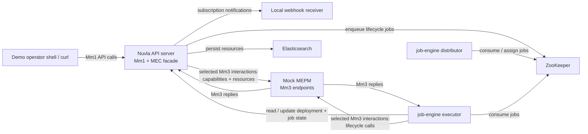

# Nuvla MEC Local Demo Runbook

## Purpose

This document describes a practical way to stand up a realistic local environment and run a demo-oriented ETSI MEC compliance exercise for the currently implemented Nuvla MEC subset.

The goal is not to reproduce a full operator deployment. The goal is to demonstrate, on one machine, that:

- Nuvla exposes the selected `Mm1` MEC lifecycle and package APIs
- Nuvla exchanges the selected southbound MEC interactions with an external `MEPM` over `Mm3`
- asynchronous lifecycle completion flows through the real `job-engine`
- durable subscriptions and webhook notifications work for matching lifecycle events
- evidence can be collected for a demo or a validation rehearsal

The runbook uses the explicit public API roots implemented in Nuvla today:

- `http://localhost:8200/api/mec/mm1/app_pkgm/v1` for northbound package management
- `http://localhost:8200/api/mec/mm1/app_lcm/v1` for northbound lifecycle management
- `http://localhost:8200/api/mec/internal/mm3/app_lcm/v1/notifications` for the internal southbound callback receiver

## Demo Setup Diagram



In this diagram, `Mm3` is shown as a neutral southbound reference point. In ETSI MEC `010-2` (cross-checked
against `ETSI GS MEC 010-2 V4.1.1`), some `Mm3` sub-interfaces are produced by the `MEO` and some by the
`MEPM`. This local demo mainly exercises the runtime path where Nuvla calls the external `MEPM` for
capabilities/resources and application lifecycle.


## What This Demo Can Credibly Show

This local runbook is well suited to demonstrate:

- `MEC 003` MEO positioning for the selected scope
- `MEC 010-2` package, app instance, lifecycle operation, subscription, and notification flows
- `MEC 037` basic package onboarding and descriptor access for the supported subset
- the end-to-end path `Mm1 -> Nuvla deployment/job -> job-engine -> Mm3 -> notification`
- reconciliation of unexpected app-state changes after the `MEPM` emits a southbound `Mm3.003` notification

This runbook does **not** by itself close the remaining open items around:

- policy/admission gates before instantiation
- artifact signature or integrity enforcement
- evidence packaging beyond collected traces and logs
- a fully realistic commissioned `nuvlabox` inventory
- autonomous host-failure detection independent of the `MEPM` event stream

## Recommended Topology

For a local demo, I would use the following topology.

### Recommended baseline

- one local Elasticsearch process
- one local ZooKeeper process
- one `api-server` started directly from the source tree
- one `job-engine` distributor started directly from the source tree
- one `job-engine` executor started directly from the source tree
- one mock `MEPM` started from the `api-server` source tree
- one local webhook receiver started from the shell

This is the best balance between realism and setup effort because:

- the code you demo is the code in your current workspace
- jobs are processed asynchronously by the real `job-engine`
- the southbound dependency is still controllable via the built-in mock `MEPM`
- you avoid the ambiguity of prebuilt images versus local source state

### Important startup caveat

This repository does not currently expose a simple committed `lein run` launcher for the full API server. For a source-tree demo, the practical approach is to:

- start local Elasticsearch and ZooKeeper yourself
- start the API server from a REPL with a thin Jetty wrapper
- initialize the DB binding, ZooKeeper client, resources, and data explicitly

That is slightly more manual than the containerized path, but it keeps the whole demo on your local source tree.

## Prerequisites

- local Elasticsearch reachable on `localhost:9200`
- local ZooKeeper reachable on `localhost:2181`
- `curl`
- `jq`
- Java and Leiningen
- Python 3.11+ and Poetry for `job-engine`
- this repository checked out locally

## Recommended Directory Roles

- `api-server/code`: source tree used to run the API server and mock `MEPM`
- `job-engine`: source tree used to run the distributor and executor

## Step 1: Start Local Elasticsearch and ZooKeeper

You still need persistent backing services even in a pure source-tree setup:

- Elasticsearch for the Nuvla persistent store
- ZooKeeper for the job queue

If you already have them installed locally, just ensure they are running on:

- `localhost:9200`
- `localhost:2181`

On macOS, one common approach is to use Homebrew-managed services. For example:

```bash
brew install zookeeper
brew services start zookeeper
```

For Elasticsearch, use your preferred native installation method and verify that the cluster is reachable:

```bash
curl http://localhost:9200
```

ZooKeeper can be checked with:

```bash
nc -z localhost 2181
```

## Step 2: Start the API Server from the Source Tree

Open a shell:

```bash
cd "/Users/ale/projects/nuvla/api-server/code"
lein with-profile +dev,+test repl
```

In the REPL, start a thin HTTP server over the normal route stack:

```clojure
(require
  '[com.sixsq.nuvla.db.loader :as db-loader]
  '[com.sixsq.nuvla.server.app.routes :as app-routes]
  '[com.sixsq.nuvla.server.resources.common.dynamic-load :as dyn]
  '[com.sixsq.nuvla.server.resources.lifecycle-test-utils :as ltu]
  '[com.sixsq.nuvla.server.util.zookeeper :as uzk]
  '[ring.adapter.jetty :as jetty])

(db-loader/load-and-set-persistent-db-binding 'com.sixsq.nuvla.db.es.loader)
(uzk/set-client! (uzk/create-client))
(dyn/initialize)
(dyn/initialize-data)

(def api-port 8200)

(def api-server
  (try
    (jetty/run-jetty
      (ltu/ring-app)
      {:port api-port :join? false})
    (catch java.net.BindException e
      (throw (ex-info (format "API server could not bind to port %d. Stop the previous REPL/server instance or choose a different port." api-port)
                      {:port api-port}
                      e)))))
```

This should expose the API on:

- `http://localhost:8200/api/cloud-entry-point`

## Step 3: Confirm the API Is Up

```bash
curl http://localhost:8200/api/cloud-entry-point | jq .
```

## Step 4: Start the Mock MEPM

Open a second shell:

```bash
cd "/Users/ale/projects/nuvla/api-server/code"
lein with-profile +dev,+test repl
```

In the REPL:

```clojure
(require '[com.sixsq.nuvla.server.resources.mec.mock-mepm-server :as mock])
(mock/start-server! 18081)
(mock/reset-state!)
```

Leave this REPL running during the demo.

## Step 5: Start the Job Distributor and Job Executor from the Source Tree

Open a third shell for the distributor:

```bash
cd "/Users/ale/projects/nuvla/job-engine"
poetry install --with server
poetry run python nuvla/scripts/job_distributor.py \
  --api-url http://localhost:8200 \
  --api-insecure \
  --api-authn-header group/nuvla-admin \
  --zk-hosts localhost:2181
```

Open a fourth shell for the executor:

```bash
cd "/Users/ale/projects/nuvla/job-engine"
poetry run python nuvla/scripts/job_executor.py \
  --api-url http://localhost:8200 \
  --api-insecure \
  --api-authn-header group/nuvla-admin \
  --zk-hosts localhost:2181
```

Leave both processes running.

## Step 6: Log In as Local Admin

For a source-tree demo, create the initial admin user if you do not already have one in your local datastore. If your local environment already contains the standard super user, log in with that account.

The login flow itself is:

For the remaining shell snippets, work from a directory of your choice such as `~/mec-demo`. The commands below use relative file paths, so you can run the same sequence from any current directory:

```bash
mkdir -p ~/mec-demo
cd ~/mec-demo
```

Create a session and store the cookie:

```bash
cat > nuvla-login.json <<'EOF'
{
  "template": {
    "href": "session-template/password",
    "username": "REPLACE_WITH_ADMIN_USERNAME",
    "password": "REPLACE_WITH_ADMIN_PASSWORD"
  }
}
EOF

curl \
  -X POST \
  -H 'content-type: application/json' \
  -d @nuvla-login.json \
  -c nuvla-cookies.txt \
  -b nuvla-cookies.txt \
  http://localhost:8200/api/session | jq .
```

Inspect the current session:

```bash
curl \
  -b nuvla-cookies.txt \
  http://localhost:8200/api/session | jq .
```

If the active claim is not already `group/nuvla-admin`, switch to it before continuing:

```bash
export SWITCH_GROUP_URL="$(curl -s -b nuvla-cookies.txt \
  http://localhost:8200/api/session | jq -r '.resources[0].operations[] | select(.rel=="switch-group") | .href')"

curl \
  -X POST \
  -H 'content-type: application/json' \
  -b nuvla-cookies.txt \
  -d '{"claim":"group/nuvla-admin"}' \
  "http://localhost:8200/api/${SWITCH_GROUP_URL}" | jq .

curl \
  -b nuvla-cookies.txt \
  http://localhost:8200/api/session | jq .
```

You can inspect or change MEPM behavior later:

```clojure
(mock/get-state)
(mock/set-error-mode! :server-error)
(mock/set-error-mode! nil)
```

## Step 7: Register the MEPM in Nuvla

Because everything is running locally in this variant, register the MEPM on `localhost`.

```bash
cat > mepm.json <<'EOF'
{
  "name": "Local Mock MEPM",
  "description": "Mock MEC Platform Manager for local compliance demo",
  "endpoint": "http://localhost:18081",
  "capabilities": {
    "platforms": ["kubernetes", "docker"],
    "services": ["app-lifecycle", "traffic-rules"],
    "api-version": "3.1.1"
  },
  "status": "ONLINE"
}
EOF

export MEPM_ID="$(
  curl -s \
    -X POST \
    -H 'content-type: application/json' \
    -d @mepm.json \
    -b nuvla-cookies.txt \
    http://localhost:8200/api/mepm | jq -r '."resource-id"'
)"

echo "$MEPM_ID"
```

Then confirm the southbound actions work:

```bash
curl -X POST -b nuvla-cookies.txt \
  "http://localhost:8200/api/${MEPM_ID}/check-health" | jq .

curl -X POST -b nuvla-cookies.txt \
  "http://localhost:8200/api/${MEPM_ID}/query-capabilities" | jq .

curl -X POST -b nuvla-cookies.txt \
  "http://localhost:8200/api/${MEPM_ID}/query-resources" | jq .
```

Confirm that Nuvla also created the southbound lifecycle subscription it uses for `Mm3.003` callbacks:

```bash
curl -b nuvla-cookies.txt \
  "http://localhost:8200/api/${MEPM_ID}" | jq '{
    id: .id,
    mm3SubscriptionId: ."mm3-subscription-id",
    mm3SubscriptionCallbackUri: ."mm3-subscription-callback-uri"
  }'
```

## Step 8: Prepare a Local Webhook Receiver

Run a tiny local HTTP server that prints notification payloads:

```bash
python3 - <<'PY'
from http.server import BaseHTTPRequestHandler, HTTPServer

class Handler(BaseHTTPRequestHandler):
    def do_POST(self):
        length = int(self.headers.get('content-length', 0))
        body = self.rfile.read(length).decode('utf-8')
        print("\n=== notification ===")
        print(body)
        self.send_response(200)
        self.end_headers()
        self.wfile.write(b"ok")

HTTPServer(("127.0.0.1", 18082), Handler).serve_forever()
PY
```

## Step 9: Create Durable Northbound Mm1 Subscriptions

Create a subscription for operation-occurrence notifications:

```bash
cat > subscription-op.json <<'EOF'
{
  "subscriptionType": "AppLcmOpOccStateChangeNotification",
  "callbackUri": "http://localhost:18082",
  "appLcmOpOccFilter": {
    "operationType": "INSTANTIATE"
  }
}
EOF

curl \
  -X POST \
  -H 'content-type: application/json' \
  -d @subscription-op.json \
  -b nuvla-cookies.txt \
  http://localhost:8200/api/mec/mm1/app_lcm/v1/subscriptions | jq .
```

Create a second subscription for app-instance state changes:

```bash
cat > subscription-app.json <<'EOF'
{
  "subscriptionType": "AppInstanceStateChangeNotification",
  "callbackUri": "http://localhost:18082"
}
EOF

curl \
  -X POST \
  -H 'content-type: application/json' \
  -d @subscription-app.json \
  -b nuvla-cookies.txt \
  http://localhost:8200/api/mec/mm1/app_lcm/v1/subscriptions | jq .
```

Verify subscriptions are durable:

```bash
curl -b nuvla-cookies.txt \
  http://localhost:8200/api/mec/mm1/app_lcm/v1/subscriptions | jq .
```

## Step 10: Create a MEC Application Package

Create the package shell:

```bash
cat > app-package-create.json <<'EOF'
{
  "appPkgName": "demo-mec-app",
  "appPkgVersion": "1.0.0",
  "appProvider": "Acme Corp"
}
EOF

export APP_PKG_ID="$(
  curl -s \
    -X POST \
    -H 'content-type: application/json' \
    -d @app-package-create.json \
    -b nuvla-cookies.txt \
    http://localhost:8200/api/mec/mm1/app_pkgm/v1/app_packages | tee app-package-create.out | jq -r '.appPkgId'
)"

echo "$APP_PKG_ID"
```

Then upload a valid descriptor to `package_content`:

```bash
cat > appd.json <<EOF
{
  "appName": "demo-mec-app",
  "appDescription": "Local MEC demo application",
  "appProvider": "Acme Corp",
  "appDVersion": "3.2.1",
  "appSoftVersion": "1.0.0",
  "mecVersion": "2.2.1",
  "virtualComputeDescriptor": {
    "virtualCpu": {"numVirtualCpu": 2},
    "virtualMemory": {"virtualMemSize": 2048}
  },
  "swImageDescriptor": [
    {
      "swImageName": "demo-mec-app",
      "swImageVersion": "1.0.0",
      "containerFormat": "DOCKER",
      "swImage": "sixsq/demo-mec-app:1.0.0"
    }
  ],
  "virtualStorageDescriptor": [],
  "appExtCpd": [],
  "appServiceRequired": [],
  "trafficRuleDescriptor": [],
  "dnsRuleDescriptor": [],
  "appFeatureRequired": []
}
EOF

curl \
  -X PUT \
  -H 'content-type: application/json' \
  -d @appd.json \
  -b nuvla-cookies.txt \
  "http://localhost:8200/api/mec/mm1/app_pkgm/v1/app_packages/${APP_PKG_ID}/package_content" \
  -i
```

Verify package retrieval:

```bash
curl -b nuvla-cookies.txt \
  "http://localhost:8200/api/mec/mm1/app_pkgm/v1/app_packages/${APP_PKG_ID}" | jq .

curl -b nuvla-cookies.txt \
  "http://localhost:8200/api/mec/mm1/app_pkgm/v1/app_packages/${APP_PKG_ID}/appd" | jq .

curl -b nuvla-cookies.txt \
  "http://localhost:8200/api/mec/mm1/app_pkgm/v1/app_packages/${APP_PKG_ID}/package_content" | jq .
```

## Step 11: Create an App Instance

Create the retained app instance resource:

```bash
cat > app-instance-create.json <<EOF
{
  "appDId": "${APP_PKG_ID}"
}
EOF

export APP_INSTANCE_ID="$(
  curl -s \
    -X POST \
    -H 'content-type: application/json' \
    -d @app-instance-create.json \
    -b nuvla-cookies.txt \
    http://localhost:8200/api/mec/mm1/app_lcm/v1/app_instances | tee app-instance-create.out | jq -r '.appInstanceId'
)"

echo "$APP_INSTANCE_ID"
```

Verify:

```bash
curl -b nuvla-cookies.txt \
  "http://localhost:8200/api/mec/mm1/app_lcm/v1/app_instances/${APP_INSTANCE_ID}" | jq .
```

Expected demo state before instantiate:

- `instantiationState = NOT_INSTANTIATED`
- `operationalState` is absent

## Step 12: Instantiate the App

```bash
export LCM_OP_OCC_ID="$(
  curl -s \
    -X POST \
    -H 'content-type: application/json' \
    -d '{}' \
    -b nuvla-cookies.txt \
    "http://localhost:8200/api/mec/mm1/app_lcm/v1/app_instances/${APP_INSTANCE_ID}/instantiate" | tee instantiate.out | jq -r '.lcmOpOccId'
)"

echo "$LCM_OP_OCC_ID"
```

Verify operation tracking:

```bash
curl -b nuvla-cookies.txt \
  "http://localhost:8200/api/mec/mm1/app_lcm/v1/app_lcm_op_occs/${LCM_OP_OCC_ID}" | jq .
```

Then poll until the job reaches its final state:

```bash
curl -b nuvla-cookies.txt \
  "http://localhost:8200/api/mec/mm1/app_lcm/v1/app_lcm_op_occs/${LCM_OP_OCC_ID}" | jq .

curl -b nuvla-cookies.txt \
  "http://localhost:8200/api/mec/mm1/app_lcm/v1/app_instances/${APP_INSTANCE_ID}" | jq .
```

Expected outcome:

- operation goes `STARTING/PROCESSING -> COMPLETED`
- app instance becomes `instantiationState = INSTANTIATED`
- app instance becomes `operationalState = STARTED`
- app-instance and operation-occurrence notifications are sent

Capture the southbound correlation and the persisted evidence:

```bash
export MEPM_OPERATION_ID="$(
  curl -s -b nuvla-cookies.txt \
    "http://localhost:8200/api/mec/mm1/app_lcm/v1/app_lcm_op_occs/${LCM_OP_OCC_ID}" \
    | tee app-lcm-op-occ.out | jq -r '.mepmOperationId'
)"

echo "$MEPM_OPERATION_ID"

curl -b nuvla-cookies.txt \
  "http://localhost:8200/api/${LCM_OP_OCC_ID}" | jq '."mec-last-notification"'

curl -b nuvla-cookies.txt \
  "http://localhost:8200/api/${APP_INSTANCE_ID}" | jq '."mec-last-notification"'

curl -b nuvla-cookies.txt \
  "http://localhost:8200/api/${MEPM_ID}" | jq '."mm3-last-notification"'
```

Inspect the southbound app instance in the mock `MEPM` too:

```bash
curl -s http://localhost:18081/mm3/app-instances | jq .
```

Expected mock `MEPM` state after instantiate:

- `instantiationState = INSTANTIATED`
- `operationalState = STARTED`

### Optional: Replay a Southbound `Mm3.003` Callback

The mock `MEPM` can emit a representative lifecycle notification into Nuvla's internal callback receiver. This is useful when you want to show the southbound reconciliation path and the persisted callback evidence explicitly:

```bash
export MM3_SUBSCRIPTION_ID="$(
  curl -s -b nuvla-cookies.txt \
    "http://localhost:8200/api/${MEPM_ID}" | jq -r '."mm3-subscription-id"'
)"

curl \
  -X POST \
  -H 'content-type: application/json' \
  -d @- \
  http://localhost:18081/mm3/test/emit-notification <<EOF | jq .
{
  "subscriptionId": "${MM3_SUBSCRIPTION_ID}",
  "notification": {
    "notificationType": "AppLcmOpOccStateChangeNotification",
    "subscriptionId": "${MM3_SUBSCRIPTION_ID}",
    "operationId": "${MEPM_OPERATION_ID}",
    "operationState": "COMPLETED",
    "appInstanceId": "${APP_INSTANCE_ID}",
    "instantiationState": "INSTANTIATED",
    "operationalState": "STARTED"
  }
}
EOF
```

After replaying the callback, re-run the three evidence queries above and inspect the local webhook receiver output. You should see the southbound notification persisted on the `mepm`, `deployment`, and `job` resources, together with a matching northbound notification sent to the webhook receiver.

## Step 13: Demonstrate `operate`

Demonstrate `STOPPED`:

```bash
cat > operate-stop.json <<'EOF'
{
  "changeStateTo": "STOPPED"
}
EOF

curl \
  -X POST \
  -H 'content-type: application/json' \
  -d @operate-stop.json \
  -b nuvla-cookies.txt \
  "http://localhost:8200/api/mec/mm1/app_lcm/v1/app_instances/${APP_INSTANCE_ID}/operate" | jq .
```

Then demonstrate `STARTED` again:

```bash
cat > operate-start.json <<'EOF'
{
  "changeStateTo": "STARTED"
}
EOF

curl \
  -X POST \
  -H 'content-type: application/json' \
  -d @operate-start.json \
  -b nuvla-cookies.txt \
  "http://localhost:8200/api/mec/mm1/app_lcm/v1/app_instances/${APP_INSTANCE_ID}/operate" | jq .
```

For each call, poll the returned `AppLcmOpOcc` and the `AppInstanceInfo` resource until the final state is visible.

Expected state after `operate STOPPED`:

- `instantiationState = INSTANTIATED`
- `operationalState = STOPPED`

Expected state after `operate STARTED`:

- `instantiationState = INSTANTIATED`
- `operationalState = STARTED`

### Optional: Simulate Unexpected App Stop/Crash

This variant demonstrates that Nuvla updates its view when the `MEPM` reports an unsolicited state change for a running app instance. It does **not** prove that Nuvla independently detects the crash on its own; it proves the southbound reconciliation path once the `MEPM` emits the event.

First capture the southbound subscription id and the southbound app-instance id currently known by the mock `MEPM`:

```bash
export MM3_SUBSCRIPTION_ID="$(
  curl -s -b nuvla-cookies.txt \
    "http://localhost:8200/api/${MEPM_ID}" | jq -r '."mm3-subscription-id"'
)"

export SOUTHBOUND_APP_INSTANCE_ID="$(
  curl -s \
    http://localhost:18081/mm3/app-instances | tee mm3-app-instances.out | jq -r '.instances[0].id'
)"

echo "$MM3_SUBSCRIPTION_ID"
echo "$SOUTHBOUND_APP_INSTANCE_ID"
```

Then simulate an unexpected app stop by having the mock `MEPM` emit an unsolicited `AppInstanceStateChangeNotification`:

```bash
curl \
  -X POST \
  -H 'content-type: application/json' \
  -d @- \
  http://localhost:18081/mm3/test/emit-notification <<EOF | jq .
{
  "subscriptionId": "${MM3_SUBSCRIPTION_ID}",
  "notification": {
    "notificationType": "AppInstanceStateChangeNotification",
    "subscriptionId": "${MM3_SUBSCRIPTION_ID}",
    "appInstanceId": "${SOUTHBOUND_APP_INSTANCE_ID}",
    "instantiationState": "INSTANTIATED",
    "operationalState": "STOPPED"
  }
}
EOF
```

Verify that Nuvla reflects the updated state and preserves the southbound evidence:

```bash
curl -b nuvla-cookies.txt \
  "http://localhost:8200/api/mec/mm1/app_lcm/v1/app_instances/${APP_INSTANCE_ID}" | jq .

curl -b nuvla-cookies.txt \
  "http://localhost:8200/api/${APP_INSTANCE_ID}" | jq '."mec-last-notification"'

curl -b nuvla-cookies.txt \
  "http://localhost:8200/api/${MEPM_ID}" | jq '."mm3-last-notification"'
```

Expected outcome:

- `AppInstanceInfo.operationalState` becomes `STOPPED`
- `AppInstanceInfo.instantiationState` remains `INSTANTIATED`
- the deployment keeps the latest `mec-last-notification`
- the `MEPM` resource keeps the latest `mm3-last-notification`
- the webhook receiver shows the matching northbound app-instance notification

If you want to simulate a harder failure where the application disappears entirely, emit `instantiationState = NOT_INSTANTIATED` instead. In that case, Nuvla should reconcile the retained app instance back toward `NOT_INSTANTIATED` / deployment `CREATED`.

## Step 14: Demonstrate `terminate`

```bash
curl \
  -X POST \
  -H 'content-type: application/json' \
  -d '{}' \
  -b nuvla-cookies.txt \
  "http://localhost:8200/api/mec/mm1/app_lcm/v1/app_instances/${APP_INSTANCE_ID}/terminate" | jq .
```

Expected outcome:

- operation goes to `COMPLETED`
- retained app instance returns to `instantiationState = NOT_INSTANTIATED`
- `operationalState` is absent again
- the underlying deployment is normalized back to the retained, non-instantiated state

## Step 15: Demonstrate Negative Paths

For a compliance demo, do at least one negative path per area.

### Invalid package content

```bash
cat > invalid-appd.json <<'EOF'
{
  "appName": "broken"
}
EOF

curl \
  -X PUT \
  -H 'content-type: application/json' \
  -d @invalid-appd.json \
  -b nuvla-cookies.txt \
  "http://localhost:8200/api/mec/mm1/app_pkgm/v1/app_packages/${APP_PKG_ID}/package_content" | jq .
```

Expected outcome:

- `400`
- ProblemDetails-style error body

### Unsupported operate mode

```bash
cat > operate-bad.json <<'EOF'
{
  "changeStateTo": "PAUSED"
}
EOF

curl \
  -X POST \
  -H 'content-type: application/json' \
  -d @operate-bad.json \
  -b nuvla-cookies.txt \
  "http://localhost:8200/api/mec/mm1/app_lcm/v1/app_instances/${APP_INSTANCE_ID}/operate" | jq .
```

Expected outcome:

- rejection from the selected supported subset

### Southbound error path

In the REPL running the mock `MEPM`:

```clojure
(mock/set-error-mode! :server-error)
```

Then retry `instantiate` or `operate`. After the negative test:

```clojure
(mock/set-error-mode! nil)
```

This is useful to demonstrate:

- observable failure behavior
- operation error reporting
- webhook notifications for final failed operations

## Step 16: Capture Evidence

For demo and rehearsal purposes, keep the following artifacts together in one folder:

- every request payload
- every JSON response
- the ids of created resources
- `AppLcmOpOcc.mepmOperationId` values for southbound correlation
- `mepm.mm3-last-notification`
- `deployment.mec-last-notification`
- `job.mec-last-notification`
- API server REPL console output
- job distributor console output
- job executor console output
- mock `MEPM` console output
- webhook receiver output

Useful commands:

Capture logs with shell redirection when starting each local process.

## Suggested Demo Sequence

If the goal is a 10-15 minute demo, I would present it in this order:

1. Show the local topology and the registered `MEPM`.
2. Show package onboarding with `POST /app_packages` and `GET /appd`.
3. Show retained app instance creation.
4. Show instantiate and the real `AppLcmOpOcc`, including `mepmOperationId`.
5. Show that instantiate leads to `instantiationState = INSTANTIATED` and `operationalState = STARTED` on both the northbound view and the mock `MEPM`.
6. Show the webhook receiver receiving notifications.
7. Show `operate STOPPED`, then `operate STARTED`, while `instantiationState` remains `INSTANTIATED`.
8. Optionally simulate an unsolicited app stop/crash notification from the `MEPM`.
9. Show `terminate` returning the retained instance to `NOT_INSTANTIATED`.
10. Show one negative path, preferably a forced southbound failure.

## Suggested Scenario-to-Requirement Mapping

For demo purposes, the most useful scenarios are:

- `SCN-PKG-01`: valid package onboarding
- `SCN-LCM-01`: create app instance
- `SCN-LCM-03`: get app instance
- `SCN-LCM-05`: instantiate through real flow
- `SCN-LCM-06`: terminate to retained `NOT_INSTANTIATED`
- `SCN-LCM-07`: operate start/stop subset
- `SCN-LCM-08`: unsolicited app-state change reconciled from `Mm3.003`
- `SCN-OPS-01`: list operation occurrences
- `SCN-SUB-01`: durable subscription lifecycle
- `SCN-SUB-02`: matching notifications
- `SCN-ERR-01`: standards-aligned error handling

## Optional Extension: Host-Targeted Demo

If you specifically want to showcase the `WS3` placement story, extend the demo with:

- one registered `nuvlabox`
- one `MEPM` with `mec-host-id` set to that `nuvlabox`
- app instance requests carrying `mecHostInformation.hostId`

That variant is more realistic, but it is also more setup-heavy. For a first local compliance demo, I would keep the baseline single-`MEPM` flow above.

## Recommended Claim Boundary for the Demo

At the end of the demo, I would phrase the claim like this:

> Nuvla locally demonstrates the selected MEC MVP subset with real northbound package and lifecycle APIs, real asynchronous execution through `job-engine`, southbound delegation to an external `MEPM` over `Mm3`, durable subscription-backed notifications, and persisted evidence for southbound commands and callbacks.

I would explicitly avoid claiming, in the same demo, that:

- policy-driven admission is complete
- artifact integrity/signature enforcement is complete
- the full validation evidence pack is already productized
- Nuvla independently detects host or application crashes without a southbound `MEPM` event

