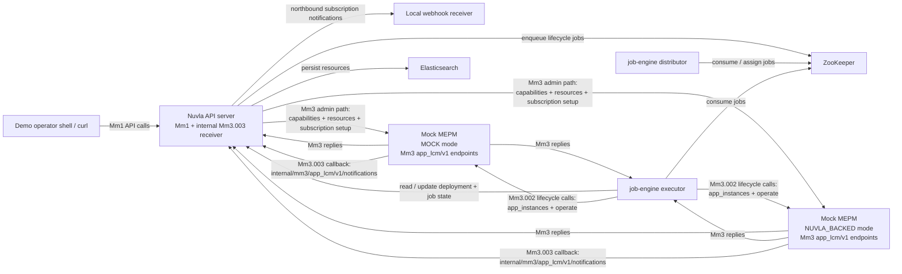

# Nuvla MEC Local Demo Runbook

## Purpose

This document describes a practical way to stand up a realistic local environment and run a demo-oriented ETSI MEC compliance exercise for the currently implemented Nuvla MEC subset.

The goal is not to reproduce a full operator deployment. The goal is to demonstrate, on one machine, that:

- Nuvla exposes the selected `Mm1` MEC lifecycle and package APIs
- Nuvla exchanges the selected southbound MEC interactions with an external `MEPM` over `Mm3`
- asynchronous lifecycle completion flows through the real `job-engine`
- durable subscriptions and webhook notifications work for matching lifecycle events
- evidence can be collected for a demo or a validation rehearsal

The runbook uses the explicit public API roots implemented in Nuvla today:

- `http://localhost:8200/api/mec/mm1/app_pkgm/v1` for northbound package management
- `http://localhost:8200/api/mec/mm1/app_lcm/v1` for northbound lifecycle management
- `http://localhost:8200/api/mec/internal/mm3/app_lcm/v1/notifications` for the internal southbound callback receiver

## Demo Setup Diagram




In this diagram, the southbound split is shown explicitly. The `job-engine` executor drives `Mm3.002`
lifecycle commands against the external `MEPM`, while the API server handles the southbound
subscription-management path and receives `Mm3.003` lifecycle callbacks on the internal receiver at
`/api/mec/internal/mm3/app_lcm/v1/notifications`. The local demo therefore exercises both the command path
from Nuvla to the `MEPM` and the event-ingestion path from the `MEPM` back into Nuvla.

## What This Demo Can Credibly Show

This local runbook is well suited to demonstrate:

- `MEC 003` MEO positioning for the selected scope
- `MEC 010-2` package, app instance, lifecycle operation, subscription, and notification flows
- `MEC 037` basic package onboarding and descriptor access for the supported subset
- the end-to-end path `Mm1 -> Nuvla deployment/job -> job-engine -> Mm3 -> notification`
- reconciliation of unexpected app-state changes after the `MEPM` emits a southbound `Mm3.003` notification

This runbook does **not** by itself close the remaining open items around:

- policy/admission gates before instantiation
- artifact signature or integrity enforcement
- a fully realistic commissioned `nuvlabox` inventory

## Recommended Topology

### Recommended baseline

- one local Elasticsearch process
- one local ZooKeeper process
- one `api-server` started directly from the source tree
- one `job-engine` distributor started directly from the source tree
- one `job-engine` executor started directly from the source tree
- two local `MEPM` processes started from the `api-server` source tree:
  - one running in plain `MOCK` mode
  - one running in `NUVLA_BACKED` mode
- one local webhook receiver started from the shell

## Prerequisites

- local Elasticsearch reachable on `localhost:9200`
- local ZooKeeper reachable on `localhost:2181`
- `curl`
- `jq`
- Java and Leiningen
- Python 3.11+ and Poetry for `job-engine`
- this repository checked out locally

## Recommended Directory Roles

- `api-server/code`: source tree used to run the API server and both local `MEPM` processes
- `job-engine`: source tree used to run the distributor and executor

## Step 1: Start Local Elasticsearch and ZooKeeper

You still need persistent backing services even in a pure source-tree setup:

- Elasticsearch for the Nuvla persistent store
- ZooKeeper for the job queue

If you already have them installed locally, just ensure they are running on:

- `localhost:9200`
- `localhost:2181`

On macOS, one common approach is to use Homebrew-managed services. For example:

```bash
brew install zookeeper
brew services start zookeeper
```

For Elasticsearch, use your preferred native installation method and verify that the cluster is reachable:

```bash
curl http://localhost:9200
```

ZooKeeper can be checked with:

```bash
nc -z localhost 2181
```

## Step 2: Start the API Server from the Source Tree

Open a shell:

```bash
cd "/Users/ale/projects/nuvla/api-server/code"
lein with-profile +dev,+test repl
```

In the REPL, start a thin HTTP server over the normal route stack:

```clojure
(require
  '[com.sixsq.nuvla.db.loader :as db-loader]
  '[com.sixsq.nuvla.server.app.routes :as app-routes]
  '[com.sixsq.nuvla.server.resources.common.dynamic-load :as dyn]
  '[com.sixsq.nuvla.server.resources.lifecycle-test-utils :as ltu]
  '[com.sixsq.nuvla.server.util.zookeeper :as uzk]
  '[ring.adapter.jetty :as jetty])

(db-loader/load-and-set-persistent-db-binding 'com.sixsq.nuvla.db.es.loader)
(uzk/set-client! (uzk/create-client))
(dyn/initialize)
(dyn/initialize-data)

(def api-port 8200)

(def api-server
  (try
    (jetty/run-jetty
      (ltu/ring-app)
      {:port api-port :join? false})
    (catch java.net.BindException e
      (throw (ex-info (format "API server could not bind to port %d. Stop the previous REPL/server instance or choose a different port." api-port)
                      {:port api-port}
                      e)))))
```

This should expose the API on:

- `http://localhost:8200/api/cloud-entry-point`

## Step 3: Confirm the API Is Up

```bash
curl http://localhost:8200/api/cloud-entry-point | jq .
```

## Step 4: Start Two Local MEPM Processes

The local demo now keeps two `MEPM` processes running side by side:

- a plain `MOCK` `MEPM`
- a `NUVLA_BACKED` `MEPM` that creates a backing Nuvla deployment when instantiated

Open a second shell for the plain `MOCK` `MEPM`:

```bash
cd "/Users/ale/projects/nuvla/api-server/code"
lein with-profile +dev,+test repl
```

In that REPL:

```clojure
(require '[com.sixsq.nuvla.server.resources.mec.mock-mepm-server :as mock])
(mock/start-server! 19081)
(mock/reset-state!)
```

Open a third shell for the `NUVLA_BACKED` `MEPM`:

```bash
cd "/Users/ale/projects/nuvla/api-server/code"
lein with-profile +dev,+test repl
```

In that REPL:

```clojure
(require '[com.sixsq.nuvla.server.resources.mec.mock-mepm-server :as mock])
(mock/start-server! 19082)
```

Leave the `NUVLA_BACKED` process running for now. After logging into Nuvla in Step 6, you will create a dedicated API key/secret and then bind that credential into this REPL before enabling `NUVLA_BACKED` mode.

Leave both REPLs running during the demo.

## Step 5: Start the Job Distributor and Job Executor from the Source Tree

Open a fourth shell for the distributor:

```bash
cd "/Users/ale/projects/nuvla/job-engine"
poetry install --with server
poetry run python nuvla/scripts/job_distributor.py \
  --api-url http://localhost:8200 \
  --api-insecure \
  --api-authn-header group/nuvla-admin \
  --zk-hosts localhost:2181
```

Open a fifth shell for the executor:

```bash
cd "/Users/ale/projects/nuvla/job-engine"
poetry run python nuvla/scripts/job_executor.py \
  --api-url http://localhost:8200 \
  --api-insecure \
  --api-authn-header group/nuvla-admin \
  --zk-hosts localhost:2181
```

Leave both processes running.

## Step 6: Log In as Local Admin

For a source-tree demo, create the initial admin user if you do not already have one in your local datastore. If your local environment already contains the standard super user, log in with that account.

The login flow itself is:

For the remaining shell snippets, work from a directory of your choice such as `~/mec-demo`. The commands below use relative file paths, so you can run the same sequence from any current directory:

```bash
mkdir -p ~/mec-demo
cd ~/mec-demo
```

Create a session and store the cookie:

```bash
cat > nuvla-login.json <<'EOF'
{
  "template": {
    "href": "session-template/password",
    "username": "REPLACE_WITH_ADMIN_USERNAME",
    "password": "REPLACE_WITH_ADMIN_PASSWORD"
  }
}
EOF

curl \
  -X POST \
  -H 'content-type: application/json' \
  -d @nuvla-login.json \
  -c nuvla-cookies.txt \
  -b nuvla-cookies.txt \
  http://localhost:8200/api/session | jq .
```

Inspect the current session:

```bash
curl \
  -b nuvla-cookies.txt \
  http://localhost:8200/api/session | jq .
```

If the active claim is not already `group/nuvla-admin`, switch to it before continuing:

```bash
export SWITCH_GROUP_URL="$(curl -s -b nuvla-cookies.txt \
  http://localhost:8200/api/session | jq -r '.resources[0].operations[] | select(.rel=="switch-group") | .href')"

curl \
  -X POST \
  -H 'content-type: application/json' \
  -b nuvla-cookies.txt \
  -d '{"claim":"group/nuvla-admin"}' \
  "http://localhost:8200/api/${SWITCH_GROUP_URL}" | jq .

curl \
  -b nuvla-cookies.txt \
  http://localhost:8200/api/session | jq .
```

Create a dedicated API key for the `NUVLA_BACKED` `MEPM` so it can call back into the Nuvla HTTP API:

```bash
cat > mepm-api-key.json <<'EOF'
{
  "name": "NUVLA_BACKED_MEPM API Key",
  "description": "API key used by the local NUVLA_BACKED MEPM to call back into Nuvla during the MEC demo",
  "template": {
    "href": "credential-template/generate-api-key",
    "ttl": 86400
  }
}
EOF

curl \
  -X POST \
  -H 'content-type: application/json' \
  -d @mepm-api-key.json \
  -c nuvla-cookies.txt \
  -b nuvla-cookies.txt \
  http://localhost:8200/api/credential | tee mepm-api-key-response.json | jq .

export NUVLA_BACKED_MEPM_API_KEY="$(jq -r '."resource-id"' mepm-api-key-response.json)"
export NUVLA_BACKED_MEPM_API_SECRET="$(jq -r '."secret-key"' mepm-api-key-response.json)"
export NUVLA_BACKED_MEPM_NUVLA_ENDPOINT="http://localhost:8200"
```

Return to the REPL running the `NUVLA_BACKED` `MEPM` and configure its reverse Nuvla API access before enabling `NUVLA_BACKED` mode:

```clojure
(require '[com.sixsq.nuvla.server.resources.mec.mock-mepm-server :as mock] :reload)
(mock/set-nuvla-auth! "http://localhost:8200"
                      "REPLACE_WITH_NUVLA_BACKED_MEPM_API_KEY"
                      "REPLACE_WITH_NUVLA_BACKED_MEPM_API_SECRET")
(mock/set-backend-mode! "NUVLA_BACKED")
```

Use the values from `NUVLA_BACKED_MEPM_API_KEY` and `NUVLA_BACKED_MEPM_API_SECRET` in that REPL call.

You can inspect or change MEPM behavior later:

```clojure
(mock/get-state)
(mock/set-error-mode! :server-error)
(mock/set-error-mode! nil)
```

## Step 7: Register Both MEPMs in Nuvla

Because everything is running locally in this variant, register both `MEPM` resources on `localhost`.

First register the plain `MOCK` `MEPM`:

```bash
cat > mepm-mock.json <<'EOF'
{
  "name": "Local Mock MEPM",
  "description": "Mock MEC Platform Manager for local compliance demo",
  "endpoint": "http://localhost:19081",
  "backend-mode": "MOCK",
  "managed-edges": [],
  "capabilities": {
    "platforms": ["kubernetes", "docker"],
    "services": ["app-lifecycle", "traffic-rules"],
    "api-version": "3.1.1"
  },
  "status": "ONLINE"
}
EOF

export MOCK_MEPM_ID="$(
  curl -s \
    -X POST \
    -H 'content-type: application/json' \
    -d @mepm-mock.json \
    -b nuvla-cookies.txt \
    http://localhost:8200/api/mepm | jq -r '."resource-id"'
)"

echo "$MOCK_MEPM_ID"
```

Then register the `NUVLA_BACKED` `MEPM`:

```bash
cat > mepm-backed.json <<'EOF'
{
  "name": "Local Nuvla-Backed MEPM",
  "description": "Mock MEPM process running in NUVLA_BACKED mode for the local compliance demo",
  "endpoint": "http://localhost:19082",
  "backend-mode": "NUVLA_BACKED",
  "managed-edges": [],
  "capabilities": {
    "platforms": ["kubernetes", "docker"],
    "services": ["app-lifecycle", "traffic-rules"],
    "api-version": "3.1.1"
  },
  "status": "ONLINE"
}
EOF

export BACKED_MEPM_ID="$(
  curl -s \
    -X POST \
    -H 'content-type: application/json' \
    -d @mepm-backed.json \
    -b nuvla-cookies.txt \
    http://localhost:8200/api/mepm | jq -r '."resource-id"'
)"

echo "$BACKED_MEPM_ID"
```

Define the endpoints explicitly for later steps:

```bash
export MOCK_MEPM_ENDPOINT="http://localhost:19081"
export BACKED_MEPM_ENDPOINT="http://localhost:19082"
```

Return to the REPL running the `NUVLA_BACKED` `MEPM` and bind it to the resource id you just created:

```clojure
(mock/set-mepm-id! "REPLACE_WITH_BACKED_MEPM_ID")
```

Then confirm the southbound actions work for both `MEPM`s:

```bash
for MEPM_ID in "${MOCK_MEPM_ID}" "${BACKED_MEPM_ID}"; do
  curl -X POST -b nuvla-cookies.txt \
    "http://localhost:8200/api/${MEPM_ID}/check-health" | jq .

  curl -X POST -b nuvla-cookies.txt \
    "http://localhost:8200/api/${MEPM_ID}/query-capabilities" | jq .

  curl -X POST -b nuvla-cookies.txt \
    "http://localhost:8200/api/${MEPM_ID}/query-resources" | jq .
done
```

Confirm that Nuvla also created the southbound lifecycle subscription it uses for `Mm3.003` callbacks on both resources:

```bash
for MEPM_ID in "${MOCK_MEPM_ID}" "${BACKED_MEPM_ID}"; do
  curl -b nuvla-cookies.txt \
    "http://localhost:8200/api/${MEPM_ID}" | jq '{
      id: .id,
      backendMode: ."backend-mode",
      mm3SubscriptionId: ."mm3-subscription-id",
      mm3SubscriptionCallbackUri: ."mm3-subscription-callback-uri"
    }'
done
```

### Step 7a: Choose the Demo Execution Strategy

The cleanest demo flow is to run the lifecycle portion twice as two explicit passes:

1. one full pass against the plain `MOCK` `MEPM`
2. one full pass against the `NUVLA_BACKED` `MEPM`

This is easier to explain live than alternating every single operation between the two `MEPM`s.

Define which edge each pass should target:

```bash
export MOCK_EDGE_ID="REPLACE_WITH_EDGE_ID_FOR_MOCK_PASS"
export BACKED_EDGE_ID="REPLACE_WITH_EDGE_ID_FOR_BACKED_PASS"
```

If you only have one local Nuvla Edge available, set both variables to the same edge id and use the MEC admin UI before each pass so that only the active `MEPM` manages that edge. The inactive `MEPM` should have no managed edges for that pass.

If you have two distinct edges available, assign one edge to each `MEPM` in the MEC admin UI and leave both running for the entire demo.

The remainder of the runbook uses an active target. Select it before Step 11 and again before repeating the lifecycle flow for the second pass:

```bash
select_demo_target() {
  case "$1" in
    mock)
      export ACTIVE_DEMO_LABEL="mock"
      export ACTIVE_MEPM_ID="${MOCK_MEPM_ID}"
      export ACTIVE_MEPM_ENDPOINT="${MOCK_MEPM_ENDPOINT}"
      export ACTIVE_EDGE_ID="${MOCK_EDGE_ID}"
      ;;
    backed)
      export ACTIVE_DEMO_LABEL="nuvla-backed"
      export ACTIVE_MEPM_ID="${BACKED_MEPM_ID}"
      export ACTIVE_MEPM_ENDPOINT="${BACKED_MEPM_ENDPOINT}"
      export ACTIVE_EDGE_ID="${BACKED_EDGE_ID}"
      ;;
    *)
      echo "usage: select_demo_target mock|backed" >&2
      return 1
      ;;
  esac

  printf 'Demo pass: %s\nMEPM: %s\nEndpoint: %s\nEdge: %s\n' \
    "${ACTIVE_DEMO_LABEL}" "${ACTIVE_MEPM_ID}" "${ACTIVE_MEPM_ENDPOINT}" "${ACTIVE_EDGE_ID}"
}
```

Recommended sequence:

```bash
select_demo_target mock
# run Steps 11-14 once

select_demo_target backed
# run Steps 11-14 again
```

## Step 8: Prepare a Local Webhook Receiver

Run a tiny local HTTP server that prints notification payloads:

```bash
python3 - <<'PY'
from http.server import BaseHTTPRequestHandler, HTTPServer

class Handler(BaseHTTPRequestHandler):
    def do_POST(self):
        length = int(self.headers.get('content-length', 0))
        body = self.rfile.read(length).decode('utf-8')
        print("\n=== notification ===")
        print(body)
        self.send_response(200)
        self.end_headers()
        self.wfile.write(b"ok")

HTTPServer(("127.0.0.1", 19083), Handler).serve_forever()
PY
```

## Step 9: Create Durable Northbound Mm1 Subscriptions

Create a subscription for operation-occurrence notifications:

```bash
cat > subscription-op.json <<'EOF'
{
  "subscriptionType": "AppLcmOpOccStateChange",
  "callbackUri": "http://localhost:19083",
  "appLcmOpOccFilter": {
    "operationType": "INSTANTIATE"
  }
}
EOF

curl \
  -X POST \
  -H 'content-type: application/json' \
  -d @subscription-op.json \
  -b nuvla-cookies.txt \
  http://localhost:8200/api/mec/mm1/app_lcm/v1/subscriptions | jq .
```

Create a second subscription for app-instance state changes:

```bash
cat > subscription-app.json <<'EOF'
{
  "subscriptionType": "AppInstanceStateChange",
  "callbackUri": "http://localhost:19083"
}
EOF

curl \
  -X POST \
  -H 'content-type: application/json' \
  -d @subscription-app.json \
  -b nuvla-cookies.txt \
  http://localhost:8200/api/mec/mm1/app_lcm/v1/subscriptions | jq .
```

Verify subscriptions are durable:

```bash
curl -b nuvla-cookies.txt \
  http://localhost:8200/api/mec/mm1/app_lcm/v1/subscriptions | jq .
```

## Step 10: Create a MEC Application Package

Create the package shell:

```bash
cat > app-package-create.json <<'EOF'
{
  "appPkgName": "demo-mec-app",
  "appPkgVersion": "1.0.0",
  "appProvider": "Acme Corp"
}
EOF

export APP_PKG_ID="$(
  curl -s \
    -X POST \
    -H 'content-type: application/json' \
    -d @app-package-create.json \
    -b nuvla-cookies.txt \
    http://localhost:8200/api/mec/mm1/app_pkgm/v1/app_packages | tee app-package-create.out | jq -r '.appPkgId'
)"

echo "$APP_PKG_ID"
```

Then upload a valid descriptor to `package_content`:

```bash
cat > appd.json <<EOF
{
  "appName": "demo-mec-app",
  "appDescription": "Local MEC demo application backed by a public nginx container",
  "appProvider": "Acme Corp",
  "appDVersion": "3.2.1",
  "appSoftVersion": "1.0.0",
  "mecVersion": "2.2.1",
  "virtualComputeDescriptor": {
    "virtualCpu": {"numVirtualCpu": 2},
    "virtualMemory": {"virtualMemSize": 2048}
  },
  "swImageDescriptor": [
    {
      "swImageName": "demo-mec-app",
      "swImageVersion": "1.0.0",
      "containerFormat": "DOCKER",
      "swImage": "nginx:1.27-alpine"
    }
  ],
  "virtualStorageDescriptor": [],
  "appExtCpd": [],
  "appServiceRequired": [],
  "trafficRuleDescriptor": [],
  "dnsRuleDescriptor": [],
  "appFeatureRequired": []
}
EOF

curl \
  -X PUT \
  -H 'content-type: application/json' \
  -d @appd.json \
  -b nuvla-cookies.txt \
  "http://localhost:8200/api/mec/mm1/app_pkgm/v1/app_packages/${APP_PKG_ID}/package_content" \
  -i
```

Verify package retrieval:

```bash
curl -b nuvla-cookies.txt \
  "http://localhost:8200/api/mec/mm1/app_pkgm/v1/app_packages/${APP_PKG_ID}" | jq .

curl -b nuvla-cookies.txt \
  "http://localhost:8200/api/mec/mm1/app_pkgm/v1/app_packages/${APP_PKG_ID}/appd" | jq .

curl -b nuvla-cookies.txt \
  "http://localhost:8200/api/mec/mm1/app_pkgm/v1/app_packages/${APP_PKG_ID}/package_content" | jq .
```

## Step 11: Create an App Instance for the Active Demo Pass

Before running this step, select the target pass:

```bash
select_demo_target mock
# or later:
# select_demo_target backed
```

Create the retained app instance resource targeted to the active edge:

```bash
cat > app-instance-create.json <<EOF
{
  "appDId": "${APP_PKG_ID}",
  "mecHostInformation": {
    "hostId": "${ACTIVE_EDGE_ID}"
  }
}
EOF

export APP_INSTANCE_ID="$(
  curl -s \
    -X POST \
    -H 'content-type: application/json' \
    -d @app-instance-create.json \
    -b nuvla-cookies.txt \
    http://localhost:8200/api/mec/mm1/app_lcm/v1/app_instances | tee app-instance-create.out | jq -r '.appInstanceId'
)"

echo "$APP_INSTANCE_ID"
```

Verify:

```bash
curl -b nuvla-cookies.txt \
  "http://localhost:8200/api/mec/mm1/app_lcm/v1/app_instances/${APP_INSTANCE_ID}" | jq .
```

Expected demo state before instantiate:

- `instantiationState = NOT_INSTANTIATED`
- `operationalState` is absent
- `mecHostInformation.hostId = ${ACTIVE_EDGE_ID}`

## Step 12: Instantiate the App

```bash
export LCM_OP_OCC_ID="$(
  curl -s \
    -X POST \
    -H 'content-type: application/json' \
    -d '{}' \
    -b nuvla-cookies.txt \
    "http://localhost:8200/api/mec/mm1/app_lcm/v1/app_instances/${APP_INSTANCE_ID}/instantiate" | tee instantiate.out | jq -r '.lcmOpOccId'
)"

echo "$LCM_OP_OCC_ID"
```

Verify operation tracking:

```bash
curl -b nuvla-cookies.txt \
  "http://localhost:8200/api/mec/mm1/app_lcm/v1/app_lcm_op_occs/${LCM_OP_OCC_ID}" | jq .
```

Then poll until the job reaches its final state:

```bash
curl -b nuvla-cookies.txt \
  "http://localhost:8200/api/mec/mm1/app_lcm/v1/app_lcm_op_occs/${LCM_OP_OCC_ID}" | jq .

curl -b nuvla-cookies.txt \
  "http://localhost:8200/api/mec/mm1/app_lcm/v1/app_instances/${APP_INSTANCE_ID}" | jq .
```

Expected outcome:

- operation goes `STARTING/PROCESSING -> COMPLETED`
- app instance becomes `instantiationState = INSTANTIATED`
- app instance becomes `operationalState = STARTED`
- app-instance and operation-occurrence notifications are sent

Capture the southbound correlation and the persisted evidence:

```bash
export MEPM_OPERATION_ID="$(
  curl -s -b nuvla-cookies.txt \
    "http://localhost:8200/api/mec/mm1/app_lcm/v1/app_lcm_op_occs/${LCM_OP_OCC_ID}" \
    | tee app-lcm-op-occ.out | jq -r '.mepmOperationId'
)"

echo "$MEPM_OPERATION_ID"

curl -b nuvla-cookies.txt \
  "http://localhost:8200/api/${LCM_OP_OCC_ID}" | jq '."mec-last-notification"'

curl -b nuvla-cookies.txt \
  "http://localhost:8200/api/${APP_INSTANCE_ID}" | jq '."mec-last-notification"'

curl -b nuvla-cookies.txt \
  "http://localhost:8200/api/${ACTIVE_MEPM_ID}" | jq '."mm3-last-notification"'
```

Capture the southbound app-instance id created on the active `MEPM` and inspect its state:

```bash
export SOUTHBOUND_APP_INSTANCE_ID="$(
  curl -s "${ACTIVE_MEPM_ENDPOINT}/mm3/app_lcm/v1/app_instances" \
    | tee mm3-app-instances.out \
    | jq -r --arg app "${APP_INSTANCE_ID}" '.instances[] | select(.descriptor.appInstanceId == $app) | .id'
)"

echo "$SOUTHBOUND_APP_INSTANCE_ID"

curl -s "${ACTIVE_MEPM_ENDPOINT}/mm3/app_lcm/v1/app_instances" | jq .

curl -s \
  "${ACTIVE_MEPM_ENDPOINT}/mm3/app_lcm/v1/app_lcm_op_occs/${MEPM_OPERATION_ID}" | jq .
```

Expected active `MEPM` state after instantiate:

- `instantiationState = INSTANTIATED`
- `operationalState = STARTED`
- southbound `app_lcm_op_occ` status = `COMPLETED`

For the `NUVLA_BACKED` pass, the `SOUTHBOUND_APP_INSTANCE_ID` should be a `deployment/...`
identifier corresponding to the backing deployment created by the active `MEPM`.

For the `NUVLA_BACKED` pass, capture and verify the backing deployment directly in Nuvla as well:

```bash
export BACKING_DEPLOYMENT_ID="${SOUTHBOUND_APP_INSTANCE_ID}"

curl -b nuvla-cookies.txt \
  "http://localhost:8200/api/${BACKING_DEPLOYMENT_ID}" | tee backing-deployment.out | jq .
```

Expected backing deployment state for the `NUVLA_BACKED` pass:

- `parent` points to a native `credential/...`
- `module.subtype = application`
- `module.content.docker-compose` contains `nginx:1.27-alpine`
- deployment state converges to `STARTED`

If you have shell access to the target Nuvla Edge host, you can add one concrete runtime probe to show that the container is really up on the host and not just accepted by the control plane:

```bash
docker ps --filter "ancestor=nginx:1.27-alpine" \
  --format 'table {{.Image}}\t{{.Status}}\t{{.Names}}'
```

Expected probe outcome:

- at least one running container is shown for `nginx:1.27-alpine`
- the `Status` column reports an `Up ...` value

If your target edge is the same local machine running the demo, run the probe directly in a local shell. If the edge is remote, run the same command over your normal shell access path to that host.

### Optional: Replay a Southbound `Mm3.003` Callback

The active `MEPM` can emit a representative lifecycle notification into Nuvla's internal callback receiver. This is useful when you want to show the southbound reconciliation path and the persisted callback evidence explicitly:

```bash
export MM3_SUBSCRIPTION_ID="$(
  curl -s -b nuvla-cookies.txt \
    "http://localhost:8200/api/${ACTIVE_MEPM_ID}" | jq -r '."mm3-subscription-id"'
)"

curl \
  -X POST \
  -H 'content-type: application/json' \
  -d @- \
  "${ACTIVE_MEPM_ENDPOINT}/mm3/test/emit-notification" <<EOF | jq .
{
  "subscriptionId": "${MM3_SUBSCRIPTION_ID}",
  "notification": {
    "notificationType": "AppLcmOpOccNotification",
    "subscriptionId": "${MM3_SUBSCRIPTION_ID}",
    "operationId": "${MEPM_OPERATION_ID}",
    "operationState": "COMPLETED",
    "appInstanceId": "${SOUTHBOUND_APP_INSTANCE_ID}",
    "instantiationState": "INSTANTIATED",
    "operationalState": "STARTED"
  }
}
EOF
```

After replaying the callback, re-run the three evidence queries above and inspect the local webhook receiver output. You should see the southbound notification persisted on the `mepm`, `deployment`, and `job` resources, together with a matching northbound notification sent to the webhook receiver.

## Step 13: Demonstrate `operate`

Demonstrate `STOPPED`:

```bash
cat > operate-stop.json <<'EOF'
{
  "changeStateTo": "STOPPED"
}
EOF

curl \
  -X POST \
  -H 'content-type: application/json' \
  -d @operate-stop.json \
  -b nuvla-cookies.txt \
  "http://localhost:8200/api/mec/mm1/app_lcm/v1/app_instances/${APP_INSTANCE_ID}/operate" | jq .
```

Then demonstrate `STARTED` again:

```bash
cat > operate-start.json <<'EOF'
{
  "changeStateTo": "STARTED"
}
EOF

curl \
  -X POST \
  -H 'content-type: application/json' \
  -d @operate-start.json \
  -b nuvla-cookies.txt \
  "http://localhost:8200/api/mec/mm1/app_lcm/v1/app_instances/${APP_INSTANCE_ID}/operate" | jq .
```

For each call, poll the returned `AppLcmOpOcc` and the `AppInstanceInfo` resource until the final state is visible.

Expected state after `operate STOPPED`:

- `instantiationState = INSTANTIATED`
- `operationalState = STOPPED`

Expected state after `operate STARTED`:

- `instantiationState = INSTANTIATED`
- `operationalState = STARTED`

### Optional: Simulate Unexpected App Stop/Crash

This variant demonstrates that Nuvla updates its view when the `MEPM` reports an unsolicited state change for a running app instance. It does **not** prove that Nuvla independently detects the crash on its own; it proves the southbound reconciliation path once the `MEPM` emits the event.

First capture the southbound subscription id and the southbound app-instance id currently known by the active `MEPM`:

```bash
export MM3_SUBSCRIPTION_ID="$(
  curl -s -b nuvla-cookies.txt \
    "http://localhost:8200/api/${ACTIVE_MEPM_ID}" | jq -r '."mm3-subscription-id"'
)"

export SOUTHBOUND_APP_INSTANCE_ID="$(
  curl -s \
    "${ACTIVE_MEPM_ENDPOINT}/mm3/app_lcm/v1/app_instances" | tee mm3-app-instances.out | jq -r --arg app "${APP_INSTANCE_ID}" '.instances[] | select(.descriptor.appInstanceId == $app) | .id'
)"

echo "$MM3_SUBSCRIPTION_ID"
echo "$SOUTHBOUND_APP_INSTANCE_ID"
```

Then simulate an unexpected app stop by having the active `MEPM` emit an unsolicited `AppInstNotification`:

```bash
curl \
  -X POST \
  -H 'content-type: application/json' \
  -d @- \
  "${ACTIVE_MEPM_ENDPOINT}/mm3/test/emit-notification" <<EOF | jq .
{
  "subscriptionId": "${MM3_SUBSCRIPTION_ID}",
  "notification": {
    "notificationType": "AppInstNotification",
    "subscriptionId": "${MM3_SUBSCRIPTION_ID}",
    "appInstanceId": "${SOUTHBOUND_APP_INSTANCE_ID}",
    "instantiationState": "INSTANTIATED",
    "operationalState": "STOPPED"
  }
}
EOF
```

First verify that the active `MEPM` itself now reflects the unsolicited state change:

```bash
curl \
  "${ACTIVE_MEPM_ENDPOINT}/mm3/app_lcm/v1/app_instances/${SOUTHBOUND_APP_INSTANCE_ID}" | jq .
```

Then verify that Nuvla reflects the updated state and preserves the southbound evidence:

```bash
curl -b nuvla-cookies.txt \
  "http://localhost:8200/api/mec/mm1/app_lcm/v1/app_instances/${APP_INSTANCE_ID}" | jq .

curl -b nuvla-cookies.txt \
  "http://localhost:8200/api/${APP_INSTANCE_ID}" | jq '."mec-last-notification"'

curl -b nuvla-cookies.txt \
  "http://localhost:8200/api/${ACTIVE_MEPM_ID}" | jq '."mm3-last-notification"'
```

Expected outcome:

- the active `MEPM` app instance now reports `operationalState = STOPPED`
- `AppInstanceInfo.operationalState` becomes `STOPPED`
- `AppInstanceInfo.instantiationState` remains `INSTANTIATED`
- the deployment keeps the latest `mec-last-notification`
- the `MEPM` resource keeps the latest `mm3-last-notification`
- the webhook receiver shows the matching northbound app-instance notification

If you want to simulate a harder failure where the application disappears entirely, emit `instantiationState = NOT_INSTANTIATED` instead. In that case, Nuvla should reconcile the retained app instance back toward `NOT_INSTANTIATED` / deployment `CREATED`.

## Step 14: Demonstrate `terminate`

```bash
curl \
  -X POST \
  -H 'content-type: application/json' \
  -d '{}' \
  -b nuvla-cookies.txt \
  "http://localhost:8200/api/mec/mm1/app_lcm/v1/app_instances/${APP_INSTANCE_ID}/terminate" | jq .
```

Expected outcome:

- operation goes to `COMPLETED`
- retained app instance returns to `instantiationState = NOT_INSTANTIATED`
- `operationalState` is absent again
- the underlying deployment is normalized back to the retained, non-instantiated state

After finishing the first pass, switch targets and repeat Steps 11-14 for the second `MEPM`:

```bash
select_demo_target backed
```

If you started with the `NUVLA_BACKED` pass instead, switch back to `mock` here instead.

## Step 15: Demonstrate Negative Paths

For a compliance demo, do at least one negative path per area.

### Invalid package content

```bash
cat > invalid-appd.json <<'EOF'
{
  "appName": "broken"
}
EOF

curl \
  -X PUT \
  -H 'content-type: application/json' \
  -d @invalid-appd.json \
  -b nuvla-cookies.txt \
  "http://localhost:8200/api/mec/mm1/app_pkgm/v1/app_packages/${APP_PKG_ID}/package_content" | jq .
```

Expected outcome:

- `400`
- ProblemDetails-style error body

### Unsupported operate mode

```bash
cat > operate-bad.json <<'EOF'
{
  "changeStateTo": "PAUSED"
}
EOF

curl \
  -X POST \
  -H 'content-type: application/json' \
  -d @operate-bad.json \
  -b nuvla-cookies.txt \
  "http://localhost:8200/api/mec/mm1/app_lcm/v1/app_instances/${APP_INSTANCE_ID}/operate" | jq .
```

Expected outcome:

- rejection from the selected supported subset

### Southbound error path

In the REPL running the active `MEPM` for the current pass:

```clojure
(mock/set-error-mode! :server-error)
```

Then retry `instantiate` or `operate`. After the negative test:

```clojure
(mock/set-error-mode! nil)
```

This is useful to demonstrate:

- observable failure behavior
- operation error reporting
- webhook notifications for final failed operations

