# MEC 003 Architecture Diagrams
## Visual Reference for Nuvla as MEO

**Document Version:** 1.0  
**Date:** 21 October 2025  
**Purpose:** Visual diagrams for MEC 003 architectural alignment

---

## 1. MEC System Architecture Overview

### 1.1 Standard MEC 003 Architecture

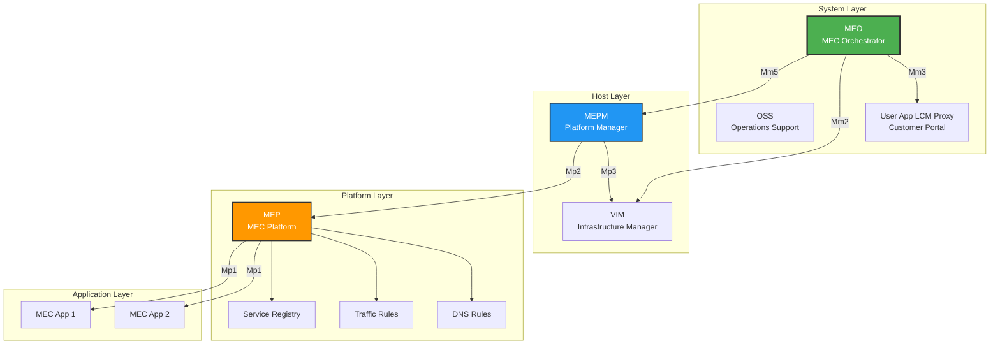

### 1.2 Nuvla as MEO Architecture

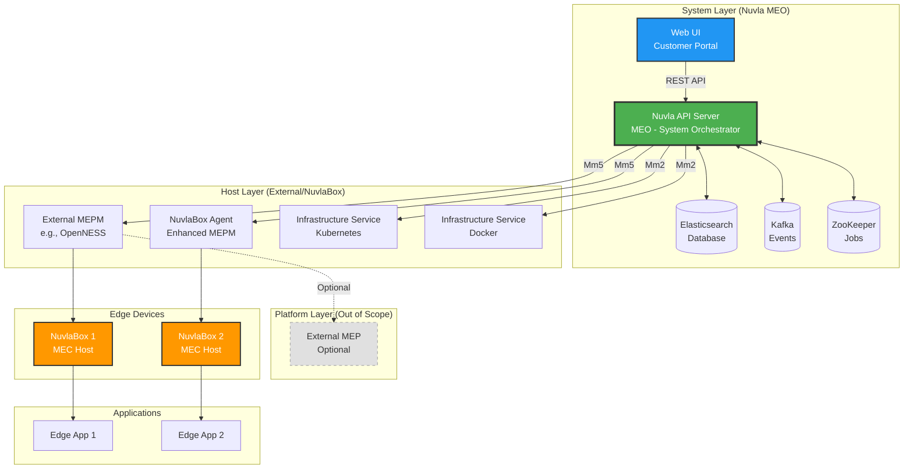

---

## 2. Component Mapping Diagram

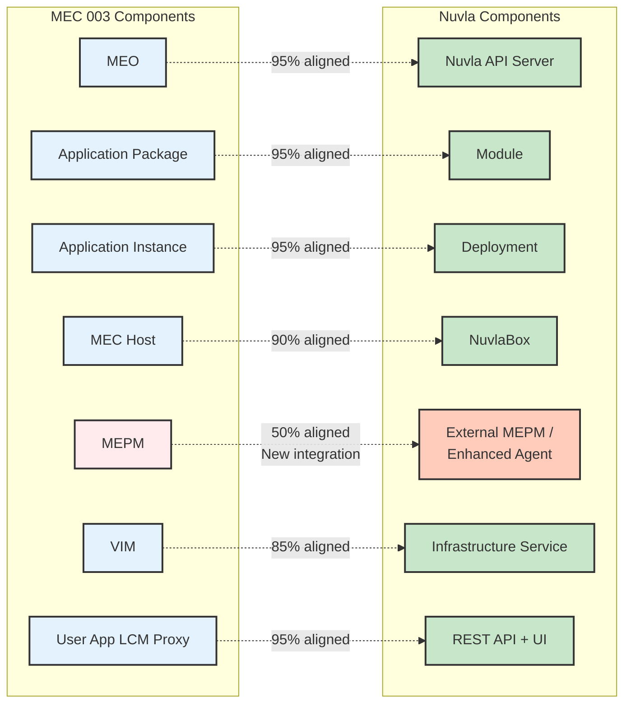

---

## 3. Deployment Models

### 3.1 Model 1: Nuvla MEO + External MEPM

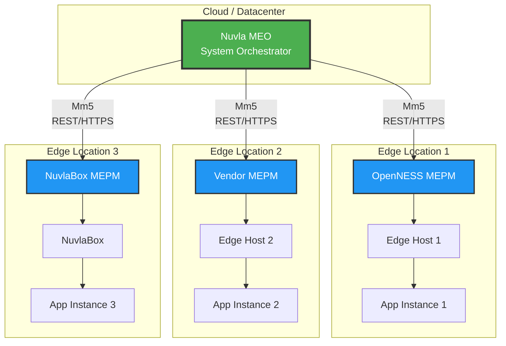

**Use Case:** Enterprise edge with multi-vendor infrastructure  
**Benefits:** Unified orchestration, leverage existing MEPMs, heterogeneous support

### 3.2 Model 2: Nuvla Full Stack

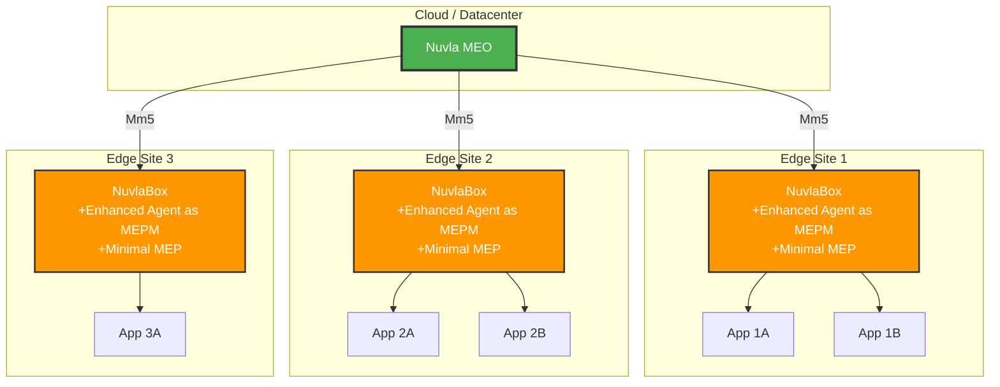

**Use Case:** Greenfield IoT/Edge deployment with Nuvla ecosystem  
**Benefits:** Single vendor solution, simplified management, tight integration

### 3.3 Model 3: Federated MEO (Future)

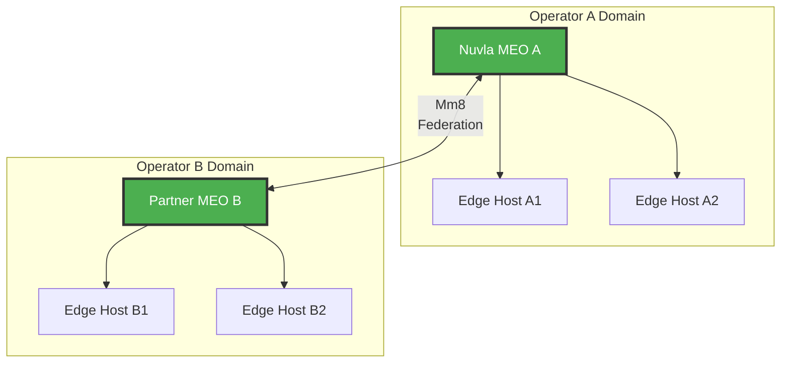

**Use Case:** Multi-operator edge federation (MEC 040)  
**Benefits:** Cross-operator coordination, resource sharing, geographic distribution

---

## 4. Trust Domains

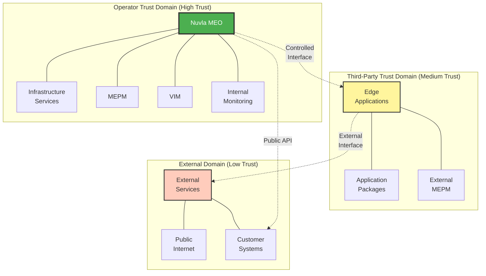

**Security Boundaries:**
- **Operator Domain:** Mutual TLS, internal network, high trust
- **Third-Party Domain:** API key auth, resource quotas, sandboxing
- **External Domain:** OAuth2, rate limiting, low trust

---

## 5. Application Lifecycle Flow

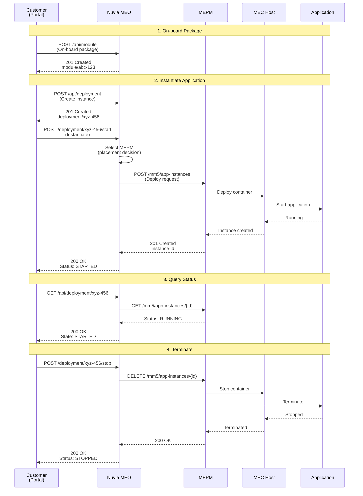

---

## 6. Reference Point (Interface) Overview

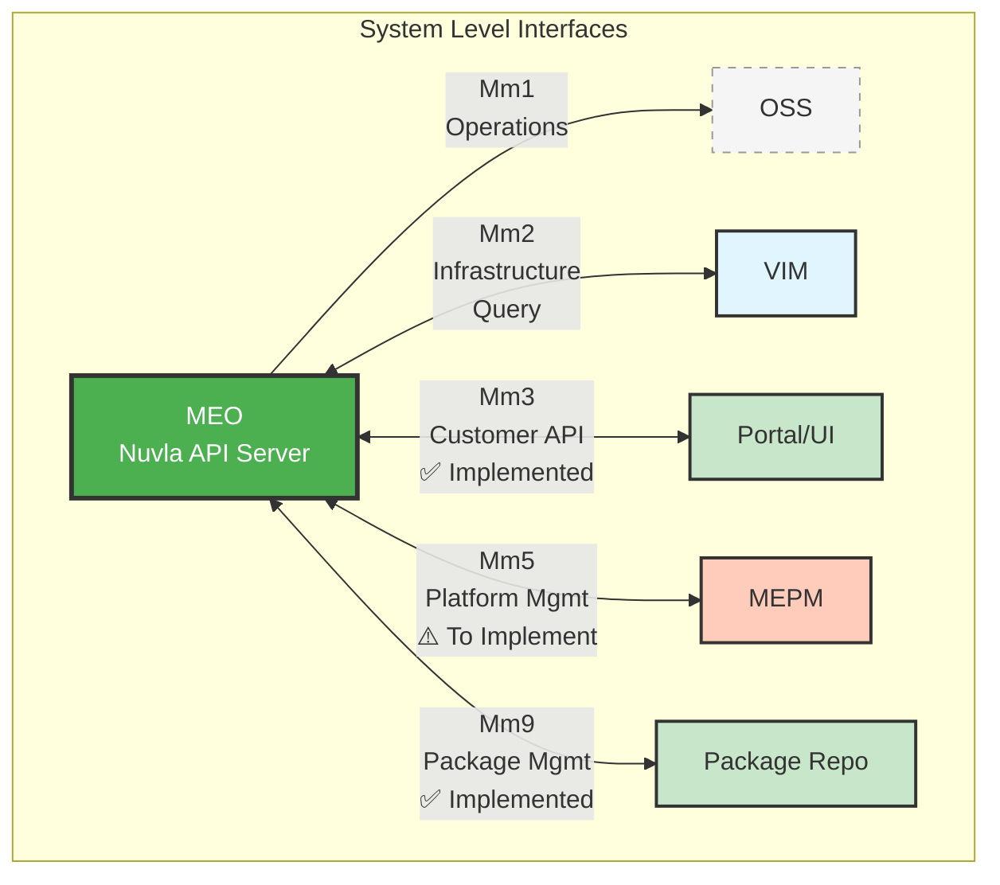

**Interface Status:**
- ✅ **Mm3** (Portal API) - Fully implemented
- ✅ **Mm9** (Package Repo) - Module API functional
- ⚠️ **Mm2** (VIM Query) - Partial (infrastructure service)
- ⚠️ **Mm5** (MEPM Communication) - To be standardized
- ❌ **Mm1** (OSS) - Out of scope (optional integration)

---

## 7. Mm5 Interface Protocol

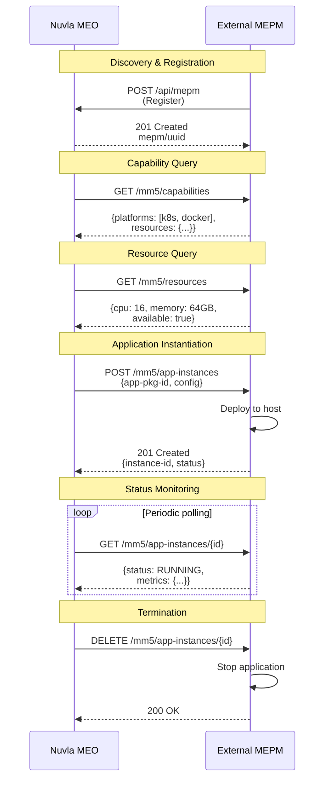

---

## 8. Data Model Overview

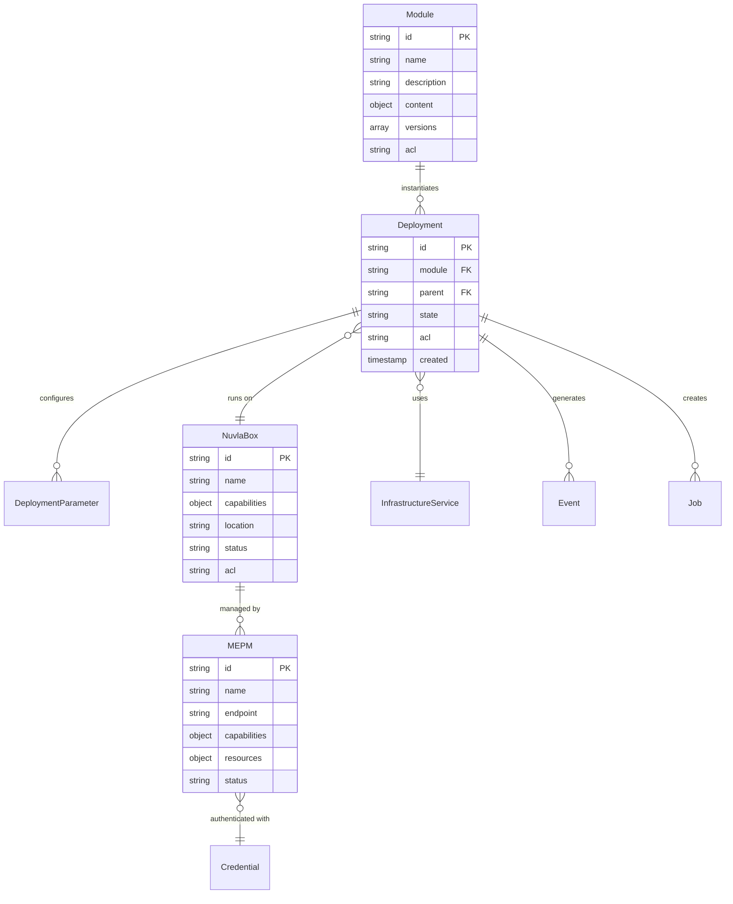

**Key Relationships:**
- **Module** (MEC: Application Package) → **Deployment** (MEC: Application Instance)
- **Deployment** runs on **NuvlaBox** (MEC: MEC Host)
- **NuvlaBox** managed by **MEPM** (MEC: Platform Manager)

---

## 9. Implementation Roadmap Visual

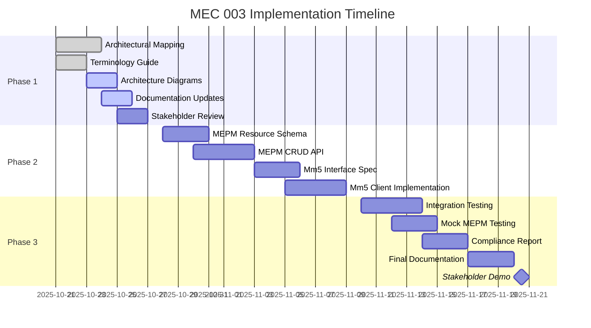

**Timeline:** 4-6 weeks (21 Oct - 20 Nov 2025)  
**Current Status:** Phase 1, Week 1 (66% complete)

---

## 10. Alignment Progress

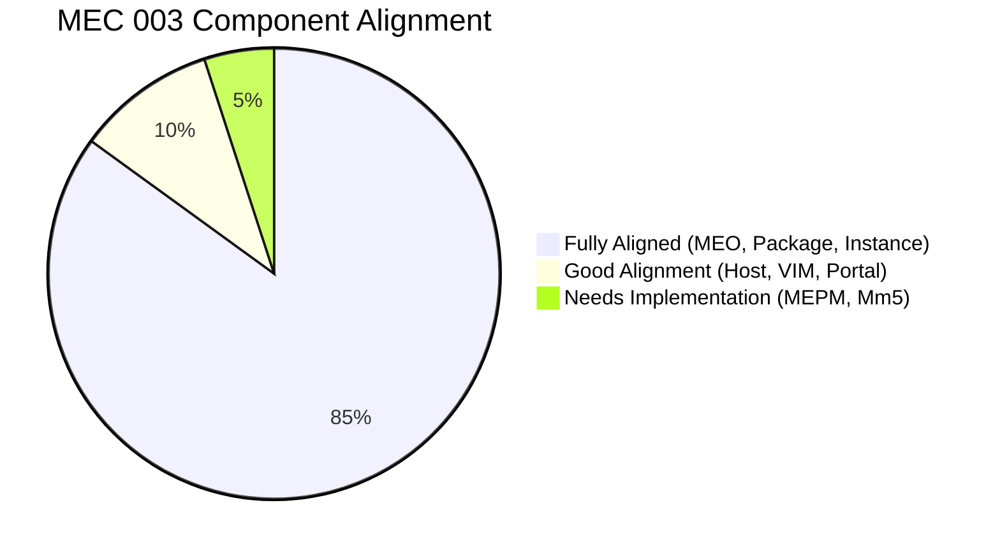

**Current Overall Alignment:** 75-80%  
**Target After Implementation:** 85-90%  
**Confidence Level:** ✅ HIGH

---

## Usage Notes

These diagrams are created using **Mermaid** syntax and can be:

1. **Rendered in GitHub/GitLab** - Automatically displayed in markdown
2. **Exported as Images** - Using Mermaid CLI or online tools
3. **Embedded in Presentations** - Export to PNG/SVG
4. **Updated Easily** - Text-based, version control friendly

**Recommended Tools:**
- [Mermaid Live Editor](https://mermaid.live/) - Online rendering
- VS Code Mermaid Extension - Local preview
- GitHub/GitLab - Native rendering

---

**Document Status:** ✅ Complete  
**Format:** Mermaid diagrams in Markdown  
**Next Steps:** Export to images for presentations if needed
