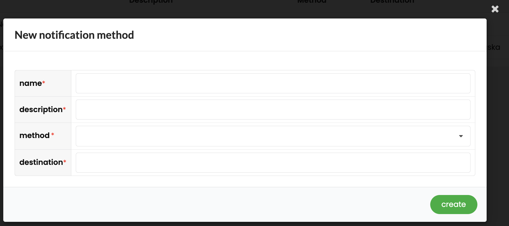
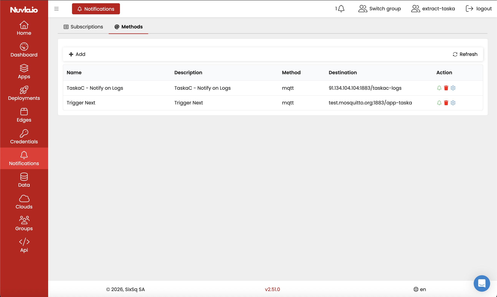
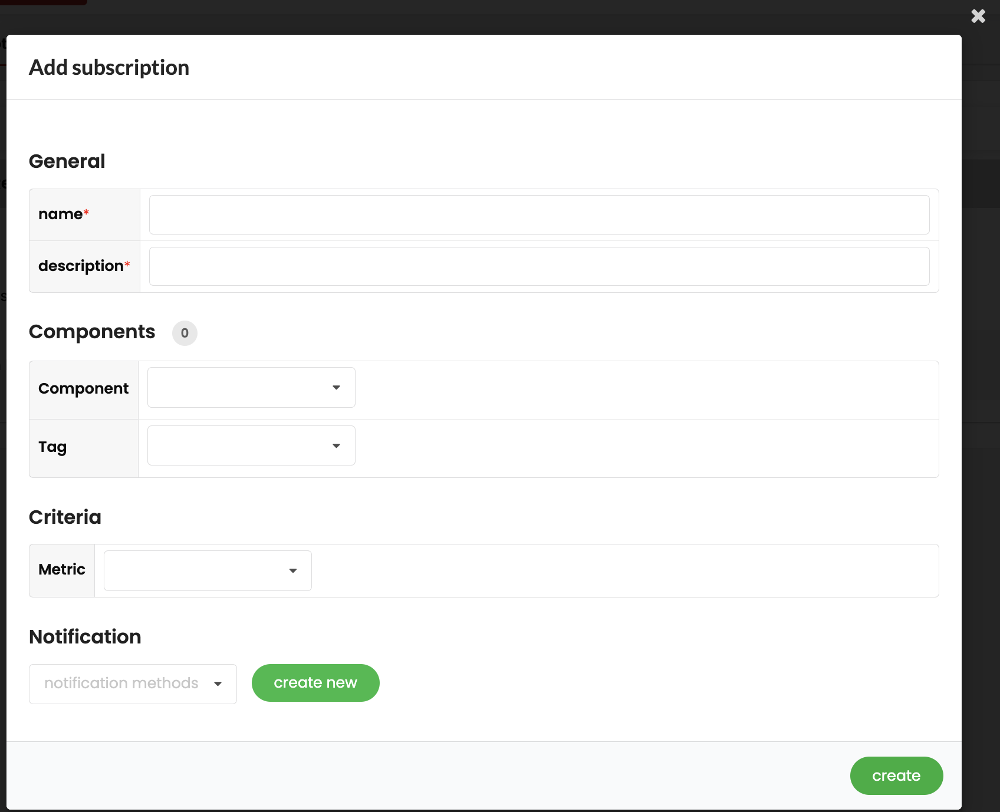
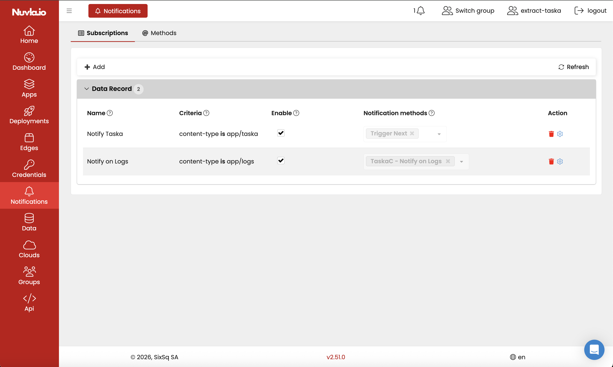

# Preparing Nuvla for EXTRACT Use Cases

## 1. Purpose and Scope

This document provides a high-level but implementation-aware description of the main configuration steps needed to prepare Nuvla Cloud for EXTRACT use cases, with specific emphasis on the data catalogue and the notification setup associated with it.

## 2. References to Nuvla Online Documentation

The following public Nuvla documentation pages should be used as the reference material for preparing the environment before configuring EXTRACT use cases:

- [Managed Infrastructures](https://docs.nuvla.io/nuvla/user-guide/infrastructures/)
- [Nuvla API Reference](https://docs.nuvla.io/nuvla/user-guide/api/)
- [Managing Data](https://docs.nuvla.io/nuvla/advanced-usage/manage-data/)

These references are useful for the following preparation tasks:

- registering infrastructure services in Nuvla, including S3-compatible services
- creating and storing the required credentials or keys
- understanding the relationship between `data-object`, `data-record`, and `data-set`
- understanding how data catalogue resources are represented in Nuvla

For the purposes of EXTRACT use case preparation, the most relevant work is:

- registering the infrastructure service used by the data catalogue
- creating the credentials required to access that infrastructure
- verifying that the EXTRACT ingestion flow creates `data-record` entries with the intended metadata

## 3. Prerequisites for EXTRACT Use Cases

The following prerequisites should be in place:

- access to a Nuvla Cloud deployment
- access rights allowing creation of infrastructure services, credentials, notification methods, and subscriptions
- an infrastructure service registered in Nuvla for the target environment, for example an S3-compatible service used by the data catalogue
- the corresponding credentials or keys stored in Nuvla
- a data catalogue flow that creates `data-record` entries and emits the associated creation events
- a reachable notification destination, for example an MQTT broker, Slack webhook, or email endpoint

The last point is important: notification configuration is only meaningful if the EXTRACT ingestion flow is already producing `data-record` resources and the corresponding events that trigger the matching logic.

## 4. Role of Data Catalogue Notifications in EXTRACT

Within EXTRACT, the Nuvla data catalogue is used to register and expose data assets and their associated metadata. In the current integration pattern, a new ingestion step typically produces:

- a `data-object`, representing the stored object
- a `data-record`, representing the catalogue entry and searchable metadata
- an `event`, representing the creation of the `data-record`

The notification framework is then used to evaluate such events against configured subscription rules. When a rule matches, the framework generates a notification and forwards it to the configured delivery channel or channels.

In operational terms, this makes it possible to notify downstream components or users whenever a newly catalogued data item matches a selected condition, for example a specific `content-type`.

## 5. Notification Configuration Model

### 5.1 Configurable Notification Methods

Nuvla provides configurable notification methods so that organizations can define how notifications are delivered. The currently supported delivery method types include:

- email
- Slack
- MQTT

For EXTRACT, MQTT is particularly relevant when notifications must be consumed by external services or processing components. Email and Slack remain available where human-facing communication is required.

Each notification method is defined as a reusable configuration item in Nuvla. In practical terms, the method definition includes:

- a name
- a description
- the delivery method type
- a destination

For MQTT, the destination follows the form `<host>[:port]/<topic>`.

### 5.2 Subscription-Based Notification Configuration

Nuvla supports a subscription-oriented approach for defining notification behavior. Notification rules can be configured to associate selected conditions or events with one or more notification methods.

Within the current EXTRACT data catalogue scope, these subscription rules are primarily relevant to `data-record` related events and conditions. The user interface supports defining subscriptions under the `Data Record` category and associating them with one or more notification methods.

The criteria used in the implementation is based on `data-record` metadata, in particular `content-type`. This makes it possible to route notifications selectively depending on the type of newly ingested catalogue entry.

## 6. Step-by-Step Notification Setup in the Nuvla User Interface

Once the EXTRACT environment has been prepared and the required infrastructure services and credentials have been configured, notifications can be set up directly from the Nuvla user interface.

### 6.1 Open the Notifications Page

Navigate to the `Notifications` page in the Nuvla user interface. The page is organised into two tabs:

- `Subscriptions`
- `Methods`

The recommended configuration order is:

- first create the notification methods
- then create the subscriptions that use those methods

### 6.2 Create the Notification Methods

Open the `Methods` tab and click `Add`.

The following dialog is used to create a new notification method:

For each notification method, provide:

- a method name
- an optional description
- the method type
- the destination

The currently available method types are:

- `email`
- `Slack`
- `MQTT`

For MQTT-based EXTRACT integrations, the destination uses the format `<host>[:port]/<topic>`.

After creating the method, the test action can be used to verify that the destination is reachable and that the notification method has been defined correctly.

Example view of configured notification methods:

### 6.3 Create a Data Record Subscription

Open the `Subscriptions` tab and click `Add`.

The following dialog is used to create a new subscription:

Create the subscription under the `Data Record` category and define:

- a subscription name
- the matching criterion
- the enabled state
- the notification method or methods to be associated with the rule

In the current implementation, the main criterion used for EXTRACT is `content-type`. This allows the user to route notifications only for those data records that match a particular type of incoming data.

For example, a subscription may be configured so that only `data-record` resources carrying a selected `content-type` trigger notification delivery.

Example view of configured `Data Record` subscriptions:

### 6.4 Associate One or More Methods with Each Subscription

Each subscription can be linked to one or more notification methods. This makes it possible to:

- deliver the same event to multiple channels
- separate machine-oriented routing from user-oriented alerting
- adapt delivery behavior without changing the EXTRACT ingestion flow

### 6.5 Enable and Save the Configuration

Ensure that the subscription is enabled after creation. Once enabled, it becomes active for future matching events.

At that point, the notification setup is complete from the Nuvla user interface perspective.

## 7. End-to-End Operational Flow

Once configured, the notification flow operates as follows:

1. A new object is ingested into the EXTRACT data catalogue.
2. The catalogue producer creates the corresponding `data-object` and `data-record`.
3. The producer emits an event indicating creation of the `data-record`.
4. Nuvla evaluates the event against the configured `Data Record` subscription rules.
5. If the event matches a rule, a notification is generated and delivered to the configured destination.

This separation between ingestion and notification configuration is useful in EXTRACT because it allows the notification behavior to be changed by configuration, without modifying the core data ingestion components.
